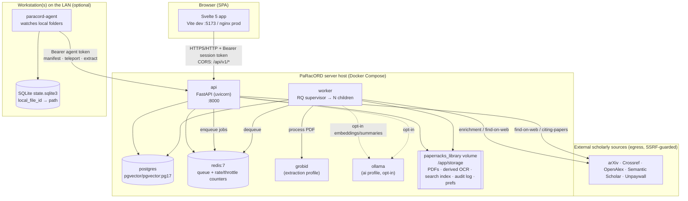
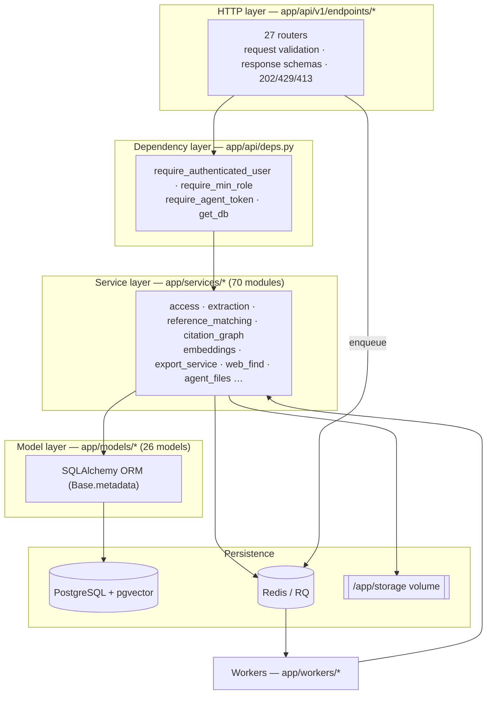
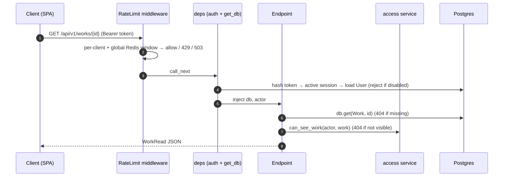

# 01 — Architecture

[← Index](00_index.md) · [Data model →](02_data_model.md)

---

## 1.1 Runtime topology

PaRacORD is a set of cooperating containers orchestrated by Docker Compose. The **API** and
**worker** share the same image and the same persisted library volume; everything else is a
supporting service.



**Boundaries (design invariants):**

- The browser never sees host filesystem paths. All file access is by opaque id + a server-side
  root-validated resolver ([§08 File access](08_security.md#83-file-access-boundaries)).
- The server never requests an arbitrary path from an agent — only opaque `local_file_id`
  (= SHA-256) values it already knows ([§06](06_agent_protocol.md)).
- Postgres, Redis, GROBID, and Ollama bind to loopback or the Docker-internal network. Only the API
  (and the SPA it serves) are meant to face the LAN.
- Every content route requires an authenticated bearer session. There is **no anonymous mode**.

## 1.2 Process model

| Container | Command | Role |
|-----------|---------|------|
| `api` | uvicorn `app.main:app` (entrypoint runs `alembic upgrade head` first) | Serves `/api/v1`, enqueues jobs, streams PDFs |
| `worker` | `python -m app.workers.supervisor` | Waits for migrations, then forks `rq_worker_count` RQ children and self-heals them |
| `postgres` | `pgvector/pgvector:pg17` | Primary store + optional pgvector ANN columns |
| `redis` | `redis:7-alpine` | RQ job queue + fixed-window rate-limit / login-throttle counters |
| `grobid` | GROBID image (compose `extraction` profile) | PDF → TEI XML |
| `ollama` | Ollama (compose `ai` profile) | Opt-in local embeddings / summaries |

The **api** and **worker** run the *same* backend image and mount the *same* `paperracks_library`
volume at `/app/storage`, so a PDF written by an upload request is readable by the worker that
extracts it. See [05 — Pipelines & workers](05_pipelines_workers.md) for the supervisor detail.

## 1.3 Layered software architecture (backend)



The architecture is a fairly classic **endpoint → dependency (auth) → service → model** stack, with
two important refinements:

1. **Two-layer authorization.** Role dependencies (`require_min_role(...)`) are only a *coarse
   floor*. Fine-grained per-object access (can this user see/modify *this* work/shelf/rack?) is
   enforced in the service layer via `app/services/access.py`. See
   [08 — Security §Authorization](08_security.md#82-authorization-authz).
2. **Off-the-read-path heavy work.** Extraction, enrichment, chunking, embedding, index rebuilds,
   dedup scans, and model pulls are pushed onto the RQ queue; endpoints return `202 {job_id}`.

## 1.4 Persistence & the dual-schema strategy

- **Production** runs the Alembic migrations (10 revisions: a 2026-07-13 squashed baseline
  `0067_squashed_baseline`, replacing the old `0001`…`0067` chain, plus `0068`–`0076`) on
  PostgreSQL. Optional **pgvector**
  columns (`embeddings.vector_pg`, `work_chunks.vec_*`) are added by best-effort, Postgres-only
  migrations and are kept **off the ORM** — read/written via raw, injection-guarded SQL.
- **Unit tests** build the schema from `Base.metadata` on **SQLite**. Postgres-only features
  degrade gracefully (JSON instead of JSONB, Python cosine instead of pgvector ANN).
- The portability idiom is `JSON().with_variant(JSONB(), "postgresql")`, used throughout the models.

Because the ORM and the migrations are two independent definitions, **when you change a model you
must write the matching migration** and verify `alembic upgrade head` + autogenerate-clean on
Postgres. See [02 — Data model](02_data_model.md) and the `test_migration_parity` test.

## 1.5 Configuration precedence

Configuration comes from four layers. For a DB-editable knob the precedence is, highest to lowest:

```
DB singleton row  >  environment variable  >  server YAML (whitelisted keys)  >  code default
```

- `backend/app/core/config.py` → `Settings(BaseSettings)`, `@lru_cache`d per process (env/YAML are
  **frozen until restart**).
- DB singletons overlay `Settings` at request time: **`AppConfig`** (page size, rate limits, batch
  caps, worker count, queue length, fuzzy-match toggle), **`AIConfig`** (embedding/summary/topic
  providers, OCR backend/language, Ollama URL), **`AccessSettings`**, **`WebFindSettings`**. A NULL
  column falls back to `Settings`; an empty table reproduces the out-of-the-box baseline.

⚠️ A large fraction of the keys in `config/server.example.yaml` are **documentation-only** — only a
whitelist is parsed by `_server_settings_from_yaml`. See
[11 — Revision notes](11_future_and_revision_notes.md#config) and
[07 — Frontend](07_frontend.md) / [08 — Security](08_security.md) for the full config surface.

## 1.6 Technology stack

| Concern | Choice |
|---------|--------|
| Backend framework | FastAPI (Python 3.12), uvicorn |
| ORM / migrations | SQLAlchemy 2.x (`DeclarativeBase`), Alembic |
| Database | PostgreSQL 17 + pgvector |
| Queue | Redis 7 + RQ (`rq`) |
| PDF extraction | GROBID (TEI), `lxml` parser |
| OCR | OCRmyPDF (default) or PyMuPDF+Tesseract |
| PDF preview/probe | PyMuPDF (`fitz`) |
| Embeddings | hash-BOW (default, dependency-free) · sentence-transformers · Ollama (opt-in) |
| Lexical search | in-house BM25F+ over a persisted scipy CSR matrix |
| Auth | bcrypt password hashes, opaque bearer session tokens (SHA-256-stored) |
| HTTP client (egress) | `httpx2` (pinned) |
| Frontend | Svelte 5 (`mount()`, Svelte-4 dialect), Vite 8, TypeScript 6 |
| Frontend viz | ECharts (citation/topic graphs and charts, force + circular layouts), PDF.js (reader) — both lazy-loaded |
| Frontend tests | Vitest 4 + @testing-library/svelte + jsdom |
| Citation styling | `citeproc-py` (CSL) for APA/IEEE/Chicago/MLA/Harvard/Vancouver/Nature |

Notable design stance: the AI/analytics layer is **keyless and dependency-free by default** —
hash-BOW embeddings, extractive summaries, TF-IDF topics all run with no external service and no
downloaded model. Heavier engines (sentence-transformers, Ollama, real CSL, YAKE) are opt-in and
degrade gracefully when absent.

## 1.7 Build, run, and test (Docker Compose is the source of truth)

The `Makefile` wraps Compose (83 targets). The essentials:

```bash
make init            # copy .env.example → .env, generate a random DB password
make up              # build + start dev stack (postgres, redis, api, worker, agent, frontend)
make migrate         # alembic upgrade head (also run automatically by the api entrypoint)
make bootstrap-admin # create the first owner account (server-console only)
make ps / make logs  # status / logs

# profiles
make up-extraction   # add the GROBID service
make up-ai           # add the Ollama service
make up-all          # everything

# quality & tests
make fix             # ruff autofix + format (host-local, fast)
make test            # lightweight unit tests in the api container
make test-full       # full unit suite
make test-safety     # the adversarial safety battery (see 08 — Security)
make test-migrations # migration parity check
make e2e             # Playwright end-to-end journeys
make ready           # fix + pre-commit + docker checks before pushing
make openapi         # regenerate the OpenAPI schema

# operations
make backup / make restore
make reset-admin-password / make revoke-sessions
make prod-build / make prod-up / make prod-smoke
```

> **Test tiers (project convention):** `make test` is lightweight only. Verify real behavior with
> `make test-full` plus the `up-extraction`/`up-ai` profiles where relevant, and run
> `make test-safety` before shipping anything that touches auth, file access, or egress.

## 1.8 Request lifecycle (bird's-eye)

A typical authenticated read, end to end (detailed in [04 — API surface](04_api_surface.md#5-request-sequence)):



Mutating requests swap the visibility check for `can_modify_work` (403 on failure) and often end by
enqueuing a job and returning `202 {job_id, status}`.
