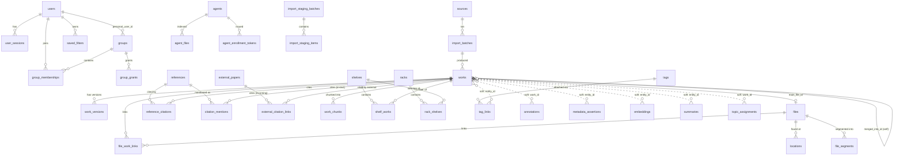
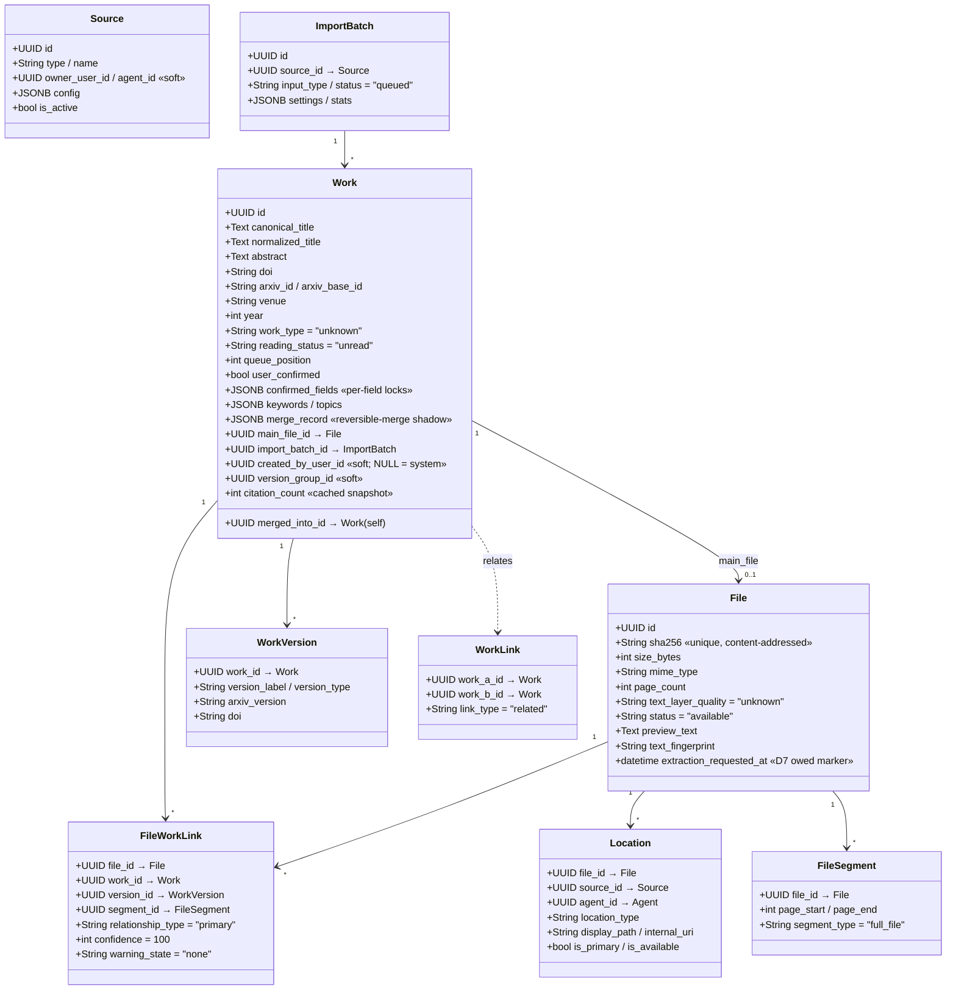
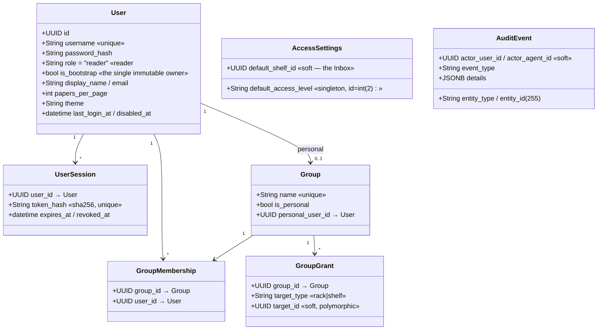

# 02 — Data Model

[← Architecture](01_architecture.md) · [Backend services →](03_backend_services.md)

Source of truth: `backend/app/models/*.py` (27 model files) and the 61 Alembic migrations in
`backend/alembic/versions/`. This documents the schema the ORM defines **today**.

---

## 2.1 Global conventions

- **Base / engine.** `Base` is a plain `DeclarativeBase` (`app/db/base.py`). `pgvector.sqlalchemy`
  is imported purely so schema reflection recognizes `vector` columns provisioned by raw DDL and
  kept off the ORM. The engine is a single sync `create_engine(..., pool_pre_ping=True)` with a
  `sessionmaker(autocommit=False, autoflush=False)`; `get_db()` is the FastAPI dependency.
- **Primary keys.** Almost every table uses `id: Uuid` with a Python-side `default=uuid.uuid4`.
  Association tables use composite PKs; `EmbeddingModelRegistry` is keyed on a text `slug`.
- **Timestamps.** `created_at`/`updated_at` are `DateTime(timezone=True)` with **Python-side**
  defaults (`datetime.now(UTC)`), not server defaults. Migration `6a310e33c3d6` converted all naive
  columns to `timestamptz`.
- **JSON portability.** The idiom `JSON().with_variant(JSONB(), "postgresql")` gives JSONB on
  Postgres and plain JSON on SQLite. `Work` also uses a `none_as_null` variant so Python `None`
  stores as SQL NULL.
- **Relationships are mostly FK-only.** Only `Reference ↔ ReferenceCitation` declare ORM
  `relationship()`. Every other cross-table link is a bare FK (or a *soft*, no-FK link) with joins
  written explicitly in services. This is a deliberate, pervasive choice — see the revision flag on
  [orphan integrity](11_future_and_revision_notes.md#data-model).

## 2.2 Entity–relationship overview

Solid edges are DB foreign keys; **dashed edges are *soft* links with no DB FK** (integrity enforced
only in the service layer). Association tables are shown as their own entities.



**Singletons** (fixed-id single-row overlays over static `Settings`, no relationships):
`ai_config`, `app_config`, `web_find_settings`, `access_settings`.
**Standalone**: `web_find_allowed_hosts`, `import_roots`, `audit_events` (soft actor links),
`duplicate_candidates` (soft polymorphic pair), `embedding_model_registry`, `missing_work_decisions`,
`custom_themes`, `default_grants`.

## 2.3 The polymorphic (discriminator) pattern

A recurring shape — `entity_type: String` + `entity_id: Uuid` **with no foreign key** — attaches
rows to a work/shelf/rack/citation-context/search-result generically:

| Table | Discriminator columns |
|-------|----------------------|
| `tag_links` | `entity_type`, `entity_id` |
| `metadata_assertions` | `entity_type`, `entity_id`, `field_name` |
| `embeddings` | `entity_type`, `entity_id`, `model_name` |
| `summaries` | `entity_type`, `entity_id`, `summary_type` |
| `topic_assignments` | `scope_type`, `scope_id`, `work_id` |
| `duplicate_candidates` | `entity_a_type/id`, `entity_b_type/id` (a **pair**) |
| `audit_events` | `entity_type`, `entity_id` (as `String255`) |
| `group_grants`, `default_grants` | `target_type` (`rack`/`shelf`), `target_id` |
| `annotations` | implicit `work_id` (no FK) |

**Consequence:** deleting a parent (e.g. a `Work`) leaves these rows dangling unless a service
cleans them up. This is the single biggest integrity risk in the schema — see
[§11 data-model flags](11_future_and_revision_notes.md#data-model).

## 2.4 Domain groups

### Core library



The core deliberately separates concepts — **do not collapse it into "one PDF = one paper."** A
`File` is a physical content-addressed artifact (dedup by `sha256`); a `Work` is the conceptual
paper; `FileWorkLink` is the many-to-many with rich attributes (which version/segment, confidence,
warning state); `WorkVersion` and `FileSegment` model multi-version and multi-work-per-file cases.

### Organization

| Table | Class | Notes |
|-------|-------|-------|
| `shelves` | `Shelf` | `name`, `status`, **`access_level`** (`open`/`visible`/`private`), soft `created_by_user_id` |
| `racks` | `Rack` | same shape as Shelf incl. `access_level` |
| `tags` | `Tag` | `name`/`normalized_name` (unique), `color`, **`parent_tag_id`** (soft, no self-FK) |
| `shelf_works` | `ShelfWork` | PK `(shelf_id, work_id)`; `work_id` separately indexed for access filtering |
| `rack_shelves` | `RackShelf` | PK `(rack_id, shelf_id)`; `shelf_id` separately indexed |
| `tag_links` | `TagLink` | polymorphic PK `(tag_id, entity_type, entity_id)` |

Membership is many-to-many both ways: a work can be on many shelves; a shelf can be in many racks.
The `access_level` on shelves/racks is the anchor of the whole access-control model (§2.4 Access).

### Extraction & citations

```mermaid
classDiagram
    class Reference {
        +UUID id  «canonical, shared by all citers»
        +String dedup_key  «DOI→arXiv→title:year, NOT unique»
        +Text raw_citation / title
        +String doi / arxiv_id
        +int year
        +JSONB authors
        +UUID resolved_work_id → Work  «confirmed match»
        +UUID suggested_work_id → Work  «fuzzy guess»
        +float match_score
        +String resolution_status = "unresolved"
    }
    class ReferenceCitation {
        +UUID reference_id → Reference
        +UUID citing_work_id → Work
        +UUID source_tei_id → RawTeiDocument
    }
    class CitationMention {
        +UUID citing_work_id → Work
        +UUID reference_id → Reference
        +UUID resolved_cited_work_id → Work
        +String marker_text / section_label
        +Text context_before / context_sentence / context_after
        +int page
        +JSONB pdf_coordinates  «list of {page,x,y,w,h}»
    }
    class RawTeiDocument {
        +UUID file_id / work_id  «soft»
        +String source = "grobid"
        +Text tei_xml  «kept verbatim for reprocessing»
    }
    class ExternalPaper {
        +String dedup_key  «unique»
        +String source / external_id
        +String doi / title / venue
        +Text authors  «"; "-joined»
        +int year
    }
    class ExternalCitationLink {
        +UUID external_paper_id → ExternalPaper
        +UUID work_id → Work  «this external paper cites this local work»
    }
    class WorkChunk {
        +UUID work_id → Work
        +String section
        +int position  «unique per work»
        +Text text
        +int token_count
        +vector vec_minilm_vec_nomic  «Postgres-only, off-ORM»
    }
    Reference "1" --> "*" ReferenceCitation
    Work "1" --> "*" ReferenceCitation
    Reference "1" --> "*" CitationMention
    ExternalPaper "1" --> "*" ExternalCitationLink
    Work "1" --> "*" ExternalCitationLink
    Work "1" --> "*" WorkChunk
```

Two citation directions are modeled distinctly:
- **Outgoing** (what a work cites) → canonical shared `Reference` + per-work `ReferenceCitation`
  edges + per-work `CitationMention` (in-text context with PDF coordinates).
- **Incoming** (who cites a work) → `ExternalPaper` + `ExternalCitationLink`, fetched from
  OpenAlex/Semantic-Scholar.

`MissingWorkDecision` records a per-user `import`/`ignore` decision on frequently-cited-but-missing
works, keyed by a stable normalized `missing_key`.

### AI

| Table | Class | Purpose |
|-------|-------|---------|
| `embeddings` | `Embedding` | Polymorphic dense vector. `vector` (JSON, source of truth, Python kNN) + optional Postgres-only `vector_pg`. Unique `(entity_type, entity_id, model_name)`. |
| `summaries` | `Summary` | Polymorphic summary with rich provenance (`model_name`, `provider_requested`/`provider_used`, `fallback`, `source_sections`, `content_hash`). |
| `topic_assignments` | `TopicAssignment` | Work→topic under a `(topic_model_id, scope_type, scope_id)` scope. |
| `ai_config` | `AIConfig` | **Singleton** provider config (embedding/summary/topic backends, OCR, Ollama URL). |
| `embedding_model_registry` | — | Dynamic model→pgvector-column map (PK = `slug`); drives runtime DDL. |

### Access control



The access model (migrations `0028`/`0029`/`0039`) is Linux-like: every user gets an auto-managed
**personal group** seeded with admin-configured `DefaultGrant`s; `GroupGrant` attaches a group to a
rack/shelf; `AccessSettings` holds the global default access level and the ephemeral default/Inbox
shelf. See [08 — Security](08_security.md#82-authorization-authz) for how these compose into
SEE/MODIFY decisions.

### Agents

| Table | Class | Notes |
|-------|-------|-------|
| `agents` | `Agent` | `token_hash`, `status`, per-agent privilege booleans (`can_index`/`can_extract`/`can_teleport`=false/`can_be_requested`/`processing_visibility`/`server_status_visibility`), `capabilities` JSONB |
| `agent_enrollment_tokens` | `AgentEnrollmentToken` | single-use owner-issued token (hashed) |
| `agent_files` | `AgentFile` | `local_file_id`, `sha256`, display-only paths, `import_action` (`index_only`/`index_and_extract`/`teleport`), `teleport_policy`, `processing_state`, soft `file_id`/`work_id` |

### Config / staging / misc

`AppConfig` (runtime knobs), `WebFindSettings` (download policy), `WebFindAllowedHost` (egress
allowlist), `ImportRoot` (GUI-added scan roots), `CustomTheme` (runtime YAML themes),
`ImportStagingBatch`/`ImportStagingItem` (multi-PDF extract-before-store staging),
`MetadataAssertion` (provenance-aware candidate values), `Annotation` (reader annotations),
`DuplicateCandidate` (review queue), `SavedFilter` (per-user query/scope).

## 2.5 Notable schema-design decisions

1. **Canonical shared references + per-work link table** (migration `0059`): one `references` row
   per cited thing; `reference_citations` is the many-to-many onto citing works. Mirrors the
   incoming `external_papers`/`external_citation_links` normalization.
2. **User-corrected metadata protection.** `Work.confirmed_fields` (a JSONB list of *locked* field
   names) lets enrichment overwrite everything *except* fields the user confirmed — superseding the
   coarse `user_confirmed` bool. `MetadataAssertion.selected_as_canonical` + the multi-source
   assertion store back canonical selection.
3. **Two-tier reference matching.** `resolved_work_id` (confirmed, drives all graphs/metrics) vs
   `suggested_work_id` + `match_score` (unconfirmed fuzzy guess, never auto-promoted), gated by the
   runtime toggle `AppConfig.use_fuzzy_match_as_confirmed`.
4. **Raw TEI retention.** `RawTeiDocument.tei_xml` (and `ImportStagingItem.tei_xml`) keep full
   GROBID output so extraction can be reprocessed / a staged item committed without re-running
   GROBID.
5. **Dialect-agnostic ORM + Postgres-only accelerators.** Vectors live as JSON (source of truth,
   Python kNN); pgvector columns are additive raw-DDL accelerators kept off the ORM.
   `EmbeddingModelRegistry` makes the model→column mapping dynamic.
6. **Settings singletons.** `AIConfig`/`AppConfig`/`WebFindSettings`/`AccessSettings` are fixed-id
   single-row overlays; absent/NULL reproduces `Settings` defaults.
7. **Reversible merge.** `Work.merged_into_id` + `Work.merge_record` (JSONB, `none_as_null`)
   implement single-level reversible duplicate merges (a shadow is reversible iff both are set).
8. **Role stays VARCHAR** (no Postgres enum), so adding roles (`contributor`/`librarian` from the
   `0024` redesign) needs no schema change.

## 2.6 Migration history at a glance

61 revisions, from `0001` (users + audit) through `0060` (fuzzy-match-as-confirmed) plus one
hash-named `6a310e33c3d6` (timestamptz conversion). Milestones worth knowing:

- `0003` core library · `0004`/`0005` extraction + raw TEI + mentions · `0006` dup candidates
- `0013` citation PDF coordinates → JSONB · `0018` AI config · `0019` pgvector
- `0024` role redesign · `0028`/`0029`/`0039` access control · `0034`/`0035`/`0036` chunks + chunk
  vectors + model registry
- `0056` import staging · `0057`→`0058` external citations (denormalized → normalized) · `0059`
  canonical references · `0060` fuzzy-match toggle

> Two entries show schema churn worth noting when reading migration history: `0057` created a
> denormalized `external_citations` table that `0058` immediately restructured into
> `external_papers` + `external_citation_links`. See [§11](11_future_and_revision_notes.md#data-model).
