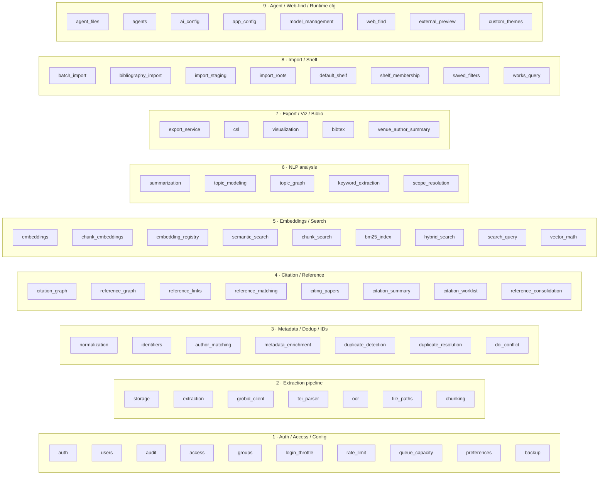
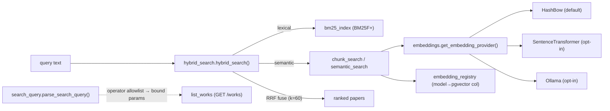

# 03 — Backend Services

[← Data model](02_data_model.md) · [API surface →](04_api_surface.md)

The service layer (`backend/app/services/`, 70 modules + `app/utils/`) holds all business logic.
Endpoints are thin; workers call the same services. This document groups the modules into 9
functional clusters, describes each module's responsibility, key functions, and core algorithm, and
ends with the cross-service collaboration map.

> Convention: services take a SQLAlchemy `Session` and commit within the caller's transaction unless
> noted. External HTTP uses the pinned `httpx2` client. "Never raises" means the function swallows
> failures and returns a status/`None` so a background job or import can't be DoS'd by one bad input.

---

## Cluster map

---

## Cluster 1 — Auth / Access / Config

| Module | Responsibility & key functions |
|--------|-------------------------------|
| **auth.py** | Sessions. `authenticate_user`, `create_user_session` (raw token returned once, stored only as `sha256`), `get_active_session`, `revoke_token`, `revoke_all_user_sessions`, `change_password`. Tokens = `secrets.token_urlsafe(32)`. Account-enumeration timing mitigated with a cached dummy-hash verify. |
| **users.py** | Owner/admin user management. `create_user`/`set_user_role`/`disable`/`enable`/`delete`/`reset_user_password`/`update_profile`. `_guard_target` is the authoritative gate: nobody targets the owner; only the owner targets an admin; delete is two-step (disable first) and cascades the personal group + sessions. |
| **audit.py** | `record_event(...)` writes a durable `AuditEvent` row **and** best-effort appends one JSON line to `audit_log_path`. ⚠️ Not cryptographically tamper-evident despite the docstring. |
| **access.py** | The SEE/MODIFY authorization core. Role ladder + `open/visible/private` levels; a paper's access = its most-permissive governing shelf. `can_see_work`/`can_modify_work`, `can_see/modify_shelf`, `visible_works_query`/`visible_work_ids` (**`None` = unrestricted admin/owner sentinel**). List endpoints *filter* rather than 403. See [08 — Security](08_security.md#82-authorization-authz). |
| **groups.py** | Personal-group lifecycle (auto-created per user, seeded with `DefaultGrant`s) + admin group/grant CRUD; every mutation audited. |
| **login_throttle.py** | Per-username failed-login lockout via a Redis sorted-set sliding window (in-process fallback). |
| **rate_limit.py** | ASGI middleware; per-client (hashed token else IP) + global fixed-1-minute Redis windows; ceilings from `AppConfig` (5 s cache). **Fails open** unless `production_require_redis`. |
| **queue_capacity.py** | `assert_queue_has_capacity(db)` → 429 when pending depth ≥ `max_queue_len`; 503 when unmeasurable + require-redis; else fail-open. Called at the top of every job-creating endpoint. |
| **preferences.py** | Per-user UI prefs, one YAML file per user under `preferences.d/<uuid>.yaml` (S11; `read_preferences`/`write_preferences`, atomic replace). The legacy single shared file is still read as a fallback until a user's first post-split write. Two users saving at once now touch different files (the old cross-user clobber is gone by construction); same-user concurrent writes (e.g. two tabs) remain last-writer-wins. |
| **access_settings.py** | Global default access level (singleton). ⚠️ Setter writes **no** audit event. |
| **backup.py** | Owner-only version-tolerant logical export/restore (batch 2026-07-13). Exports one JSONL file per table + a `manifest.json` (format version, alembic revision, hash algo, row counts), plus content-addressed `pdfs/<sha256>.pdf`. Restore maps rows by **column-name intersection** against the current schema (new columns backfilled, deleted columns dropped, renamed columns translated via `_RENAMES`); `merge` (insert-only) or `replace` (wipe-then-restore, re-inserting the current owner if the backup lacked one) modes; per-row SAVEPOINTs so one bad row never poisons the batch. |

## Cluster 2 — Extraction pipeline

Detailed data flow in [05 — Pipelines & workers](05_pipelines_workers.md); the modules:

| Module | Responsibility |
|--------|---------------|
| **storage.py** | Managed-library + server-folder ingestion. Content-addressed layout `root/aa/bb/<sha>.pdf`; SHA-256 dedup; `mark_extraction_requested` (D7 owed marker); `import_server_folder` (per-file SAVEPOINT, incremental mtime skip); `probe_pdf_openable` (fails closed on encrypted/corrupt); traversal guard `_assert_inside_root`. |
| **extraction.py** | `extract_and_store` orchestrates OCR pre-step → GROBID → TEI parse → provenance-aware persistence. `store_parsed_extraction` records every value as a `MetadataAssertion`, promotes canonical fields **only when not user-locked and empty**, stores raw TEI, rebuilds `Reference`/`ReferenceCitation`/`CitationMention` idempotently, prunes orphan references, runs reference→library matching before building mentions. |
| **grobid_client.py** | GROBID REST client (`process_fulltext_document[_sync]`, `process_citation_list_sync`). Maps `Settings` consolidation flags; requests `teiCoordinates`. `GrobidUnavailableError` on connect/timeout. |
| **tei_parser.py** | `lxml` parse of GROBID TEI → `ParsedPaper` (title/abstract/doi/venue/year/authors/references/mentions with context + PDF coords). Also `extract_body_text`/`extract_sections`. ⚠️ Uses the **default lxml parser** — safe only because TEI comes from trusted local GROBID (see [08 XXE](08_security.md#85-xxe--xml-bomb-protection)). |
| **ocr.py** | OCR seam: `ocrmypdf --skip-text` (idempotent) or PyMuPDF+Tesseract rasterize@300dpi. `maybe_ocr` **never raises** — OCR must never fail extraction. `needs_ocr(quality)` gates it. |
| **file_paths.py** | The shared root-validated PDF resolver (AUDIT A1). `resolve_backend_readable_pdf_path`, `resolve_streamable_pdf_path` (validates the **original** before preferring a derived OCR copy — closes a bypass), `save_derived_ocr_pdf`. `_validated_path` uses `resolve().relative_to(root)` (defeats `../`, absolute, and symlink escapes). |
| **chunking.py** | Section-aware passage chunking. Greedy sentence-pack to ~400 tokens (hard cap 512, 60-token overlap); skips reference/bibliography sections plus (2026-07-16) funding/acknowledgements/conflicts/author-contributions/data-availability/ethics/ORCID/supplementary-material boilerplate so none of it feeds a summary; deterministic ⇒ idempotent. ⚠️ whitespace-token proxy can overflow a 512-*token* model. |

## Cluster 3 — Metadata / Dedup / Identifiers

| Module | Responsibility & algorithm |
|--------|---------------------------|
| **utils/normalization.py** | `normalize_title`, `normalize_doi`, `arxiv_base_from_doi` (10.48550 arXiv-DOI ⇔ arXiv-id bridge), `similarity_pct` (generic fields), `title_similarity_pct` (matcher-tuned: normalize_title'd inputs, ratio+token_sort, containment only when the shorter title has ≥5 tokens). rapidfuzz is a **required** dep (the difflib fallback has no token scoring). ⚠️ `normalize_title` drops non-ASCII rather than folding. |
| **identifiers.py** | `backfill_identifiers` (fills only empty, non-locked fields); re-exports `arxiv_base_id`/`normalize_doi` from `utils/normalization.py`, the ONE canonical arXiv parser (S3) — `duplicate_detection.split_arxiv_id` now imports from the same place, so the two-parser split is resolved. |
| **author_matching.py** | `parse_author_name` (NFKD-fold surname + initial), `names_match`, `author_overlap_ratio`. ⚠️ missing-initial treated as agreement → over-matches common surnames. |
| **metadata_enrichment.py** | External enrichment. Parsers + fetchers for **arXiv / Crossref / OpenAlex / Semantic Scholar**; `enrich_work` queries a source only when the matching identifier exists (exact, no fuzzy), stores each value as a `MetadataAssertion`, promotes to canonical only for `PROMOTABLE_FIELDS` when not user-locked (`confidence=0.9`). SSRF-hardened `_get` refuses cross-host redirects. Citation-count priority openalex→s2→crossref. |
| **duplicate_detection.py** | Candidate scoring: same_doi/same_arxiv/shared_file = 1.0, fuzzy_title ≥ 0.92 (title-blocked + year guard), exact_file(SHA)=1.0, text_fingerprint=0.98, multiwork_file 0.78/0.68. `_upsert_candidate` canonicalizes the pair, keeps max score. |
| **duplicate_resolution.py** | Reversible merge/version/split. `merge_works` captures a JSON `merge_record` for exact reversal, fills empty base fields, moves owned entities (skipping dupes), handles unique-indexed DOI/arXiv via a release-then-set dance, marks source `merged_into_id`. `unmerge_work` restores the most-recent shadow. `split_multiwork_file`, `link_works`, `merge_preview`. |
| **doi_conflict.py** | Turns a Postgres `uq_works_doi` IntegrityError into an actionable message naming the offending DOI + holder. |

## Cluster 4 — Citation / Reference

| Module | Responsibility |
|--------|---------------|
| **citation_graph.py** | The cluster hub. `build_citation_graph(scope, node_mode, collapse_versions, color_by, visible_ids)` and `build_citation_neighborhood(work_id, hops≤3)`. Scope→works resolution now delegates to the shared `scope_resolution.resolve_scope_works` (S1/S2, see below) covering the same 7 scope types; clamps shadows + `visible_ids`; references resolved via persisted `resolved_work_id`; pure-Python PageRank (0.85) + exact Brandes betweenness; node caps (500). Read-only (F2 fix): the matcher owns `resolution_status`; the graph no longer writes it, and a work delete re-resolves affected references. |
| **reference_graph.py** | Per-paper reference "star": classifies each ref local / likely_local / external / citing, per-section weighted mention counts, per-local metrics (citation count, degree, topic Jaccard). |
| **reference_links.py** | Canonical-reference helpers (batch 12): `reference_dedup_key` (DOI→arXiv→`title:...|year`, capped at 512), `find_or_create_reference`, `references_for_work`. |
| **reference_matching.py** | Reference→library "likely local" matcher, shared by BOTH directions via the `MatchFields` adapter (references and external citing papers). Stage A identifier match (score 100, arXiv-DOI bridged); Stage B fuzzy `title_similarity_pct` + ±`year_tolerance` year gate + author gate, with stopword-tolerant first-content-token blocking. D2 gate treats an arXiv DOI as an arXiv id (preprint-vs-journal DOI pairs stay fuzzy-eligible). Honors `confirmed_match`/`rejected_match` and the `use_fuzzy_match_as_confirmed` toggle. Reverse-rescan (`rescan_references_for_new_work`) matches by DOI/arXiv/title-block and runs from create/import AND extraction/enrichment. ⚠️ callers must pass `visible_ids` if results are user-facing. |
| **citing_papers.py** | Incoming-citation fetcher: OpenAlex `filter=cites:` primary, S2 fallback; caps at `app_config.citing_papers_fetch_cap` (admin-configurable, S20; defaults to 1000, paged); caches `ExternalPaper`/`ExternalCitationLink`; returns the provider's full `total` and refreshes `work.citation_count/_source/_fetched_at` on store (list and snapshot can't drift). Each stored paper is run through the local matcher (`resolve_external_paper` → `resolved_work_id`; self-match guarded); `rescan_external_papers_for_new_work` is the incoming-direction reverse-rescan. ⚠️ empty-list call **wipes** existing links (destructive replace). |
| **citation_summary.py** | Scoped analytics (SEE-clamped): most-cited local/external, bridge (betweenness), isolated, frequently-cited-missing + coverage, chronological. `_SUMMARY_CACHE` is a `BoundedTTLCache` (maxsize 128, 15 min TTL) — the former unbounded dict was replaced (S10). |
| **citation_worklist.py** | Per-(user, missing_key) `import`/`ignore` decisions on cited-but-missing works. |
| **reference_consolidation.py** | Canonical-reference dedup (batch-12 "Phase 1b", S13/S14): groups `Reference` rows sharing a `dedup_key` left by pre-batch-12 data, the unlocked find-then-insert race, or legacy arXiv-DOI key shapes. A group with only compatible resolution states auto-folds into the oldest row (links/mentions repointed, metadata merged non-null-first); a real contradiction (two different confirmed targets) is never auto-folded — it gets a `|conflict:<id8>` dedup-key suffix for the Admin → Reference-dupes review tab. Idempotent; audited. |

## Cluster 5 — Embeddings / Search

| Module | Responsibility |
|--------|---------------|
| **embeddings.py** | Providers + vector math. Default **HashBow** (MD5 feature-hashing → 256-dim, L2-normalized, stable across processes, no download/egress). `SentenceTransformer`/`Ollama` opt-in, memoized per process; any failure **degrades to hash-BOW** with a `degraded` flag. `cosine_similarity`. |
| **chunk_embeddings.py** | Per-model pgvector chunk columns. `CHUNK_MODEL_COLUMNS`, `embed_work_chunks`, `backfill_chunk_embeddings`. Column name regex-guarded `^vec_[a-z0-9_]+$`; values always bound. ⚠️ per-chunk path isn't batched (one Ollama call per chunk). |
| **embedding_registry.py** | Dynamic model→column map + runtime `ALTER TABLE ADD COLUMN vector(dim)` + HNSW index (slug/regex/int-cast guarded). Cap `MAX_EMBEDDING_MODELS=8`. |
| **semantic_search.py** | Doc-level vector + lexical baseline (SQLite-testable). pgvector `1-(vec<=>q)` when enabled, else Python cosine (source of truth). ⚠️ Python fallback loads **every** embedding row into memory. |
| **chunk_search.py** | Chunk-level semantic with selectivity-adaptive pgvector scanning; access filter pushed into SQL; best-passage rollup per paper. |
| **bm25_index.py** | In-house **BM25F+** over a precomputed scipy CSR matrix, mmap-persisted and shared read-only across workers; body tokens from materialized `work_chunks` (no TEI re-parse); serves a stale index while a rebuild is enqueued. |
| **hybrid_search.py** | **RRF fusion** (`k=60`) of lexical + semantic rankings (rank-based, ignores score magnitude by design). Multimode fuses one ranking per active model. |
| **search_query.py** | Structured query grammar (`shlex`-split, allowlist keys → bound ORM params). `author:`/`year:>=2020`/`tag:`/`cites:`/`keyword:`/`topic:`/`has:pdf` etc. The SQLi guarantee lives downstream in `list_works`. |
| **vector_math.py** | Shared cosine-similarity primitives (Insights audit C4, 2026-07-14) — `dense_cosine`, `sparse_cosine`, `cosine_matrix` — replacing the duplicate implementations topic_modeling/topic_graph/visualization/embeddings used to carry separately. All degrade to 0.0 on degenerate (empty/zero/mismatched-length) inputs rather than raising. |

## Cluster 6 — NLP analysis

_No cloud LLM. The only LLM integration is a local Ollama daemon (summaries). Everything else is
dependency-free and deterministic._

| Module | Responsibility |
|--------|---------------|
| **summarization.py** | Three tiers: `extractive` (length-damped salience sentence ranking, default), `abstract`, `local_llm`. Per-paper `detail` (UX batch 4, 2026-07-16) is now **four** levels, not two: **short** (one paragraph), **detailed_fast** (one paragraph per coarse bucket — Background/Methods/Results/Other, keyword-classified), **detailed_section** (one paragraph PER GROBID section, headed by the section name — the old "detailed" behavior), **detailed_deep** (same but over leaf sub-sections; whole body, no clip) + a synthesized intro; the legacy `detail="detailed"` value is a back-compat alias for `detailed_deep`. Each `(summary_type × detail × model)` is stored as its own row (`{type}` for short, `{type}_detailed_fast`/`_detailed_section`/`_detailed_deep` otherwise) via `stored_summary_type`; up to `SUMMARY_MODEL_CACHE` (5) models are kept per (entity, detail) with LRU eviction (`_evict_stale_models`) so switching the AI model and back is instant. Detailed local-LLM summaries run on the worker (`summarize_work_job(work_id, detail)`; `POST /works/{id}/summaries` returns 202 + job id) since their many LLM calls can take minutes. SCOPE summaries are **map-reduce**: per-paper digests (`paper_detail`, any of the four levels, reused unless `regenerate_papers`; persisted so they show in the paper view; one LLM outage stops further attempts), packed into `LLM_INPUT_CHAR_BUDGET` (11k-char) chunks, condensed, synthesized with a collection-framed prompt (never "this paper"; overview + problems/methods/datasets/findings). `summarize_scope` takes `progress_cb`/`cancel_cb` (Jobs-tab progress + cooperative stop). `params` records `scope_label`/`method`/`chunks`/`paper_detail`; prompt version `local-llm-v2-map-reduce`. Degrades to extractive with `fallback_reason`. Idempotent (delete-then-insert), `content_hash`. Scope→works resolution now goes through `scope_resolution.resolve_scope_works` (see below). ⚠️ untrusted paper text enters the LLM prompt (prompt-injection surface; blast radius = a misleading summary). |
| **topic_modeling.py** | Default TF-IDF + deterministic k-means (labels = top centroid terms). Embedding backend clusters dense vectors (mean-pooled chunk vectors via SQL `avg()`). Topic dicts carry `work_ids` (best-fit first on the embedding backend) so the UI lists each topic's papers; `GET /ai/topics/latest` reconstructs a stored model from `TopicAssignment` rows (keywords recomputed deterministically) — the async-completion read path that made whole-library topic jobs visible. ⚠️ `backend="bertopic"` does **not** run BERTopic — it reuses embedding k-means. |
| **topic_graph.py** | Embedding-similarity kNN graph (numpy, `k=6`, `min_similarity=0.30`, `MAX_NODES=400`). ⚠️ **visibility depends on the caller passing `visible_ids`** — IDOR risk if an endpoint forgets it. |
| **keyword_extraction.py** | YAKE + RAKE fused via RRF, title/abstract boost, optional IDF rerank, stem-dedup. Deterministic; RAKE-only fallback if `yake` absent. |
| **scope_resolution.py** | Shared scope→works resolver (S1/S2, batch 2026-07-13) — the ONE place translating a scope into works, replacing per-feature copies (citation_graph, summarization, topic_modeling now delegate to it) whose merged-shadow/visibility handling had drifted apart. Covers all 7 scope kinds (`library`/`shelf`/`rack`/`search_result`/`selected_papers`/`saved_filter`/`import_batch`); `scope_works_query` is query-returning (count/paginate without materializing); merged shadows always excluded; `visible_ids` is a **required** kwarg — omitting it is a `TypeError`, not a silent IDOR (topic_graph.py still has its own un-migrated resolver and the older optional-kwarg risk below). |

## Cluster 7 — Export / Visualization / Bibliography

| Module | Responsibility |
|--------|---------------|
| **export_service.py** | Bibliography export in 10 formats (bibtex/biblatex/ris/csl-json/markdown/html/text/styled/latex/pandoc). Batched author/meta queries; citation keys = surname+year with collision suffixes; visibility clamp on every scope. User `citation_keys` are sanitised (F1 fix): structural chars neutralised, Unicode/`. : + / _ -` preserved, then de-duplicated. |
| **csl/engine.py** | Real CSL rendering via `citeproc-py` for APA/IEEE/Chicago/MLA/Harvard/Vancouver/Nature; layered fallback on failure. |
| **visualization.py** | Viz provider registry (5 views: temporal_map, embedding_cluster [PCA/UMAP + k-means], co_citation, topic_river, similarity_heatmap). `MAX_NODES=500`; clamps `visible_work_ids` before scope resolution. `_LAYOUT_CACHE` is a `BoundedTTLCache` (maxsize 32, 30 min TTL) — the former unbounded dict was replaced (S10). |
| **bibtex.py** | Dependency-free BibTeX **import** (balanced-brace scanner). ⚠️ `_clean_value` strips all braces (destroys `{DNA}` casing protection). |
| **venue_author_summary.py** | Venue/author aggregation over a scope (SEE-clamped). ⚠️ author key over-merges distinct people. |

## Cluster 8 — Import / Shelf

| Module | Responsibility |
|--------|---------------|
| **batch_import.py** | Batch citation import (paste raw citation lines). `preview_lines` (lookup engine via web-find fetchers, or one GROBID `processCitationList`), `commit_drafts` mints works + enqueues embedding/enrichment. ⚠️ lookup fan-out is serial. |
| **bibliography_import.py** | RIS & CSL-JSON import (shares `_find_existing` + upsert path with bibtex). ⚠️ unlike batch_import it does **not** enqueue embeddings/enrichment (searchability gap). |
| **import_staging.py** | Multi-PDF "extract before storing records": stage content-addressed → record-free GROBID → mint Work only for accepted items using the stored TEI. Magic-byte + 200 MB + openability validation; `BLOCKING_SIGNALS=(same_pdf, same_doi)`. |
| **import_roots.py** | Owner-managed server import roots (YAML immutable + DB rows; YAML wins clashes). |
| **default_shelf.py** | The ephemeral "Inbox" default shelf — invariant #1 keeps every work on ≥1 shelf. `place_on_default_if_loose`, `backfill_loose_papers_onto_default`. |
| **shelf_membership.py** | `add_work_to_shelf_checked` — the **single choke point** for shelf membership: idempotent upsert via `access.can_modify_shelf`, strips default membership. Raises framework-free domain errors (`app.errors.NotFoundError`/`PermissionDeniedError`, S4 fix) that an app-level handler maps to 404/403 for HTTP callers — worker/CLI callers get meaningful exceptions instead of the old `fastapi.HTTPException` coupling. |
| **works_query.py** | `build_works_query` — the ONE query producing "the papers this user sees under these filters" (S4: moved out of the works *endpoint* module into this service module, fixing the layering inversion where `saved_filters` had to import from the HTTP layer). Backs the Library page, saved filters, and graph/export/viz scope resolution; the endpoint now imports it like any other service helper. |
| **saved_filters.py** | Saved-filter resolution: feeds the stored query through `build_works_query` (now `services/works_query.py`, see above) floored on `visible_works_query` so it can never widen beyond the actor's visible set. |

## Cluster 9 — Agent / Web-find / Runtime config

| Module | Responsibility |
|--------|---------------|
| **agent_files.py** | Agent manifest ingestion + teleport. `ingest_manifest`, `request_teleport`, `complete_teleport(pdf_bytes)` (**hash-verified against the manifest**), `offer_teleport`, `reject/unblock`, `extract_and_index`, `discard_after_extract`. The server never holds an agent-side path. See [06](06_agent_protocol.md). |
| **agents.py** | Owner-gated enrollment: `mint_enrollment_token` (single-use, hashed, TTL), `enroll_agent`, `approve_agent` (mints the scoped agent token once), rename/delete; every step audited. |
| **agent_protocol.py** | ⚠️ **Vestigial stub** — `validate_agent_file_id` ignores its args and always returns `False`. Real logic lives in `agent_files.py`/`agents.py`. Wire up or remove. |
| **ai_config.py** | Effective AI config (DB overlay on Settings). `_validate_ollama_url` is the **SSRF gate** for the admin-set Ollama URL. |
| **app_config.py** | Effective runtime knobs (`BatchTooLargeError`, `enforce_batch_limit`, per-knob readers/writers). ⚠️ no upper bounds on any knob. |
| **model_management.py** | Provider detection + Ollama pull/delete + capability probing. ⚠️ **no integrity verification of downloaded weights**; arbitrary model strings forwarded. |
| **web_find.py** | Find-on-web aggregation + gated download (the security-heavy module). Per-source search (never raises); `resolve_final_url` re-checks SSRF + denylist + scheme on **every redirect hop**; `download_and_attach` re-classifies each hop, enforces content-type + `max_bytes` + `%PDF`. Policy modes restricted/careful/unrestricted; shadow-library denylist always wins. UX batch 3: when the direct fetch isn't a PDF, bounded fallbacks run (≤5 URLs, one landing-page read, no recursion, every URL re-gated): Elsevier Article Retrieval API for `10.1016/` DOIs (three gates: key set — admin write-only or `PARACORD_ELSEVIER_API_KEY` — ∧ `elsevier_api_enabled` master switch ∧ per-user `users.elsevier_api_allowed`, OFF by default), then `pdf_link_finder` discovery. A refused fallback host is skipped, never confirmed. See [08 SSRF](08_security.md#84-ssrf-protection). |
| **pdf_link_finder.py** | Landing-page PDF discovery (UX batch 3), pure/no-network: (1) deterministic publisher PDF-URL rewrites (ACM/Springer/Wiley/IEEE/Nature/MDPI/arXiv/ACL/OpenReview/bioRxiv/PLOS); (2) `citation_pdf_url` / `<link rel=alternate type=application/pdf>` metas; (3) scored "Download PDF" anchors (href/class/text hints, supplement/sample penalties); (4) embedded-JSON sniffing of `<script>` blobs incl. ScienceDirect `pdfft?md5&pid` reconstruction from `urlMetadata`. Callers must policy-gate every returned URL. |
| **external_preview.py** | Identifier-only reference preview (never a URL/path), delegates to enrichment fetchers, TTL cache. |
| **custom_themes.py** | Runtime custom-theme store (validate + resolve YAML, upsert by slug). |
| **utils/table_presence.py** | Per-engine optional-table cache (reflection, memoized in a `WeakKeyDictionary` keyed on `db.get_bind()`) — lets DB-overlay singletons degrade gracefully when a table is absent (fresh SQLite test DB). |

---

## Cross-service collaboration

Fan-in hubs (called by many): **`audit.record_event`** (every mutating service), **`access`**
(every content endpoint + analytics), **`citation_graph`** internals (summary/viz/reference
matching/venue-author), **`metadata_enrichment._get`** (the SSRF-hardened HTTP primitive reused by
`citing_papers`, `web_find`, `external_preview`), **`normalization`** (every matcher/importer),
**`embeddings`** (all search + topics + viz), and the shelf-placement pair
**`default_shelf.place_on_default_if_loose` + `shelf_membership.add_work_to_shelf_checked`** (every
importer).

```mermaid
flowchart TB
    extraction --> ocr & ai_config & file_paths & keyword_extraction & reference_links & reference_matching & tei_parser & audit
    extraction -->|injected| grobid_client
    reference_matching --> author_matching & citation_graph & duplicate_detection & normalization
    citation_summary --> citation_graph & access
    citing_papers --> metadata_enrichment & reference_matching
    web_find --> metadata_enrichment & web_find_allowed_hosts & web_find_settings & storage
    external_preview --> metadata_enrichment
    hybrid_search --> bm25_index & chunk_search & embeddings & embedding_registry
    chunk_search --> chunk_embeddings & embeddings & semantic_search
    topic_modeling --> embedding_registry & embeddings & tei_parser
    topic_graph --> topic_modeling
    visualization --> access & citation_graph & topic_modeling & embeddings
    export_service --> csl & audit & reference_links
    venue_author_summary --> access & citation_graph & export_service
    batch_import --> web_find & grobid_client & bibliography_import & default_shelf & shelf_membership
    import_staging --> storage & file_paths & extraction & shelf_membership
    saved_filters --> works_query
    citation_graph & summarization & topic_modeling --> scope_resolution
    agent_files --> storage & default_shelf & file_paths
    users --> audit & groups & auth
```

**Cycles broken by lazy imports:** users↔groups↔auth · web_find↔allowed_hosts/settings ·
model_management↔embeddings · embedding_registry↔chunk_embeddings.

For the ranked efficiency implications of the flagged hotspots, see
[09 — Efficiency](09_efficiency.md); for the security-relevant ones, [08 — Security](08_security.md);
all `⚠️` flags are consolidated in [11 — Revision notes](11_future_and_revision_notes.md).
