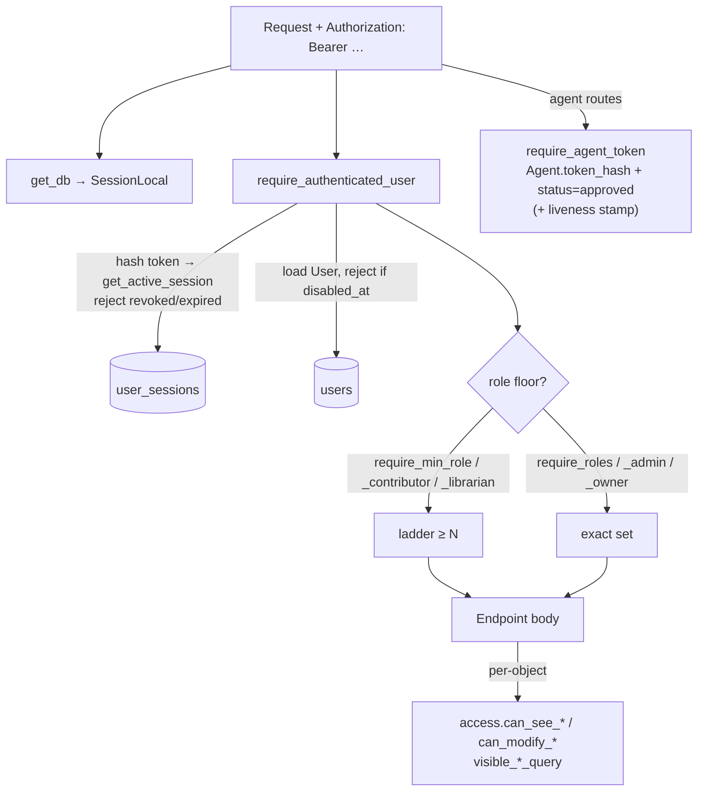
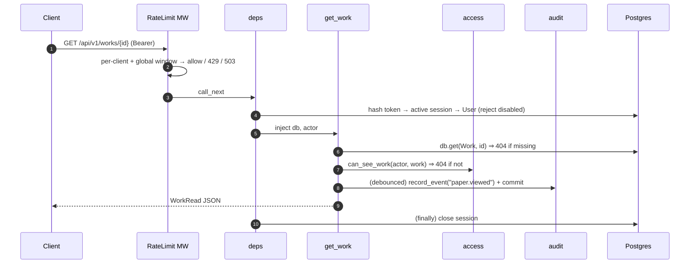

# 04 — API Surface

[← Backend services](03_backend_services.md) · [Pipelines & workers →](05_pipelines_workers.md)

Everything is mounted under `/api/v1` (`app.include_router(api_router, prefix="/api/v1")` in
`main.py`). The backend is **API-only** — the SPA is served separately (Vite dev / nginx prod), so
CORS is configured for the frontend origins. All paths below are relative to `/api/v1`.

> Reminder: the UI term **"paper"** is the code/DB **`Work`**. `/works`, `WorkRead`,
> `created_by_user_id` (= the "owner" for contributor own-only checks).

---

## 1. The dependency / authorization chain (`app/api/deps.py`)

Auth is **bearer-token session** based (`Authorization: Bearer <token>`), except agent routes which
use an agent token in the same header.



| Dependency | Enforces | Failure |
|---|---|---|
| `get_db` | Yields a `Session`, closes in `finally`; endpoints commit explicitly | — |
| `require_authenticated_user` | Valid, non-revoked, non-expired session → existing, non-disabled `User` | 401 |
| `require_roles(*roles)` | Membership in an **exact** role set | 403 |
| `require_min_role(min)` / `require_contributor` / `require_librarian` | Ladder **floor** (higher roles satisfy) | 403 |
| `require_admin` | Exact `{owner, admin}` | 403 |
| `require_owner` | Exact `owner` | 403 |
| `require_agent_token` | `Agent.token_hash` match + `status=="approved"`; side-effect: throttled `last_seen_at` stamp | 401 |

**Role ladder** (`core/security.py`, high→low): `owner(5) > admin(4) > librarian(3) > editor(2) >
contributor(1) > reader(0)`; unknown roles rank `-1`. `assert_no_guest_roles` fails app startup if a
guest/anon role is ever configured.

**Two-layer authorization.** Role deps are the coarse floor; per-object access is enforced in the
body via `app/services/access.py` (`can_see_work`/`can_modify_work`, shelf/rack variants + grant
matrix, and `visible_works_query`/`visible_work_ids` that list/graph/export queries build on).
Details in [08 — Security](08_security.md#82-authorization-authz).

**Router-level auth** (`router.py`): a blanket `Depends(require_authenticated_user)` is attached to
`sources, imports, files, works, shelves, racks, tags, citations, duplicates, graphs, viz, exports,
ai, jobs, search, preferences, themes(read), saved-filters`. **Not** router-gated: `health` (public),
`auth` (per-endpoint), the six `/admin` routers (per-endpoint `require_admin`/`require_owner`), and
`agents` (agent-token per-endpoint).

## 2. App setup & middleware (`app/main.py`)

- `create_app()` → `FastAPI(title="PaRacORD API")`, asserts no guest roles, mounts the router.
- **CORS**: `allow_origins=settings.cors_origins` (default `127.0.0.1:5173`/`localhost:5173`),
  `allow_credentials=True`, methods/headers `*`.
- **Exception handling**: only `BatchTooLargeError → 413` is registered globally; per-endpoint
  `ValueError → 400`; everything else falls to FastAPI's default 500.
- **Rate-limit middleware**: skips exempt paths (`/health`, `/docs`, `/redoc`, `/openapi.json`);
  per-client + global Redis windows; 429 + `Retry-After` on exceed; **fails open** unless
  `PARACORD_PRODUCTION_REQUIRE_REDIS` (then 503).
- **Lifespan (startup only)**: (D11) backfill loose papers onto the default shelf; (D7)
  `sweep_owed_extractions()` re-enqueue. Both best-effort so startup never blocks.
- **Login throttle** (in `auth.login`): per-username lockout → 429 + `Retry-After`.
- Session TTL default 720 min.

## 3. Cross-cutting patterns

**Response envelopes (inconsistent by design).**
- `GET /works` → full pagination envelope `PaginatedWorks {items, total, page, pages, per_page}`;
  SQL-safe sort allowlist + `order` regex; unknown sort keys silently fall back.
- `GET /admin/audit-events` → offset envelope `{items, total, limit, offset}`.
- Most other lists return **bare JSON arrays** with an optional `limit` (`ge=1, le=500`); some have
  **no limit** (`/tags`, `/shelves`, `/racks`, `/sources`, `/admin/users|agents|groups`).
- Errors are always `{"detail": "..."}`.

**Background jobs.** Many mutating endpoints call `assert_queue_has_capacity(db)`, persist an owed
marker, enqueue an RQ job, and return `202 {job_id, status}`; enqueue failure (Redis down) → 503.

**Uploads.** 200 MB hard cap + `%PDF` magic + `probe_pdf_openable` (rejects encrypted/unopenable)
before any worker runs; oversized → 413 (body read is bounded, decompression-bomb-safe).

**File streaming.** `GET /files/{id}/stream` → `FileResponse` (prefers the derived searchable-OCR
copy), auth + `can_see_file`, records `file.downloaded`; path via `resolve_streamable_pdf_path`
(forbidden → 403, missing → 404).

**Streaming responses.** `POST /works/{id}/find-on-web/stream` returns NDJSON
(`application/x-ndjson`) — one JSON per line (per-source progress + a final result). No SSE/WebSocket
anywhere.

**Audit emission.** `record_event` + commit at auth (login/logout/password), works/metadata
(`paper.viewed` debounced 300 s, `paper.metadata_edited`, `work.deleted`, reference confirm/reject),
org (shelf/rack/tag), admin (config/agent/ai/import-root/web-find/theme/queue), and `file.downloaded`.

## 4. Route tables by module

Legend for Auth: **pub** = public · **auth** = authenticated · **contrib/editor/librarian/admin/owner**
= role floor (+ per-object grant where noted). SEE = result filtered/checked by `access`.

### auth — `/auth` (per-endpoint)
| Method | Path | Auth | Notes |
|---|---|---|---|
| POST | `/login` | pub (throttled) | → `{access_token, token_type}` |
| GET/PATCH | `/me` | auth | own profile (untyped dict) |
| POST | `/change-password` | auth | revokes **other** sessions |
| POST | `/logout` | auth | revokes current token |

### works — `/works` (router: auth) — the bulk of the surface
Read routes call `_guard_see_work` (404 if not see-able); mutations call `_guard_modify_work` (403).
`AUTH`=read, `CONTRIB`=mutations (+own-only for contributors), one `EDITOR` bulk route.

| Method | Path | Auth | Summary |
|---|---|---|---|
| GET | `` | auth (SEE) | List/search papers, paginated (operator grammar `q`, `shelf_id`, `tag_id`, `sort`, `page`…) |
| POST | `` | contrib | Create paper (server-owned id/owner) |
| GET/PATCH/DELETE | `/{id}` | auth / contrib / contrib | Read (debounced `paper.viewed`) / edit (locks edited fields) / delete + dependents |
| GET | `/reading-queue`, POST `/reading-queue/reorder` | auth / contrib | Manual reading queue |
| GET | `/{id}/references`, PATCH `/{id}/references/{ref_id}`, POST `/{id}/references/rescan` | auth / contrib | Bibliography + link/reject/import + rescan |
| POST | `/references/rescan-all` | **editor** | Library-wide rematch (queued) |
| GET | `/{id}/reference-graph`, `/{id}/citation-neighborhood`, `/{id}/citation-contexts` | auth | Per-paper graphs & contexts |
| GET | `/{id}/citing-papers`, POST `/{id}/citing-papers/fetch` | auth / contrib | Incoming citers (fetch = egress) |
| GET/POST/DELETE | `/{id}/files`, PUT `/{id}/main-file/{fid}`, POST `/{id}/files/{fid}/move` | auth / contrib | Attached files |
| GET/POST/DELETE | `/{id}/annotations`, GET `/annotations/search`, `/{id}/annotations/export` | auth / contrib | Reader annotations |
| GET/POST | `/{id}/summaries` | auth / contrib | Per-paper summaries |
| GET | `/{id}/metadata`, POST `/{id}/metadata/{confirm,select,set}`, DELETE `/{id}/metadata/{aid}`, POST `/bulk-apply-metadata` | auth / contrib / editor | Provenance review + canonical selection + field locks |
| POST | `/{id}/enrich`, `/{id}/extract`, `/{id}/topics`, `/{id}/keywords` | contrib | Queue background jobs (202) |
| POST | `/{id}/find-on-web[/download\|/apply-metadata\|/stream]` | contrib | Scholarly web search (stream = NDJSON) |
| GET/POST | `/{id}/merge-preview`, `/{id}/merge`, `/{id}/unmerge`, `/from-reference/{ref_id}`, `/{id}/related`, `/{id}/related-links` | contrib/auth | Merge/unmerge, create from reference, similar/linked papers |

### files — `/files`
`GET ``` (SEE, limit≤500), `GET /{id}` (`can_see_file`), `POST /{id}/extract` (contrib, opt
`force_ocr`), `GET /{id}/stream` (SEE, `file.downloaded`), `GET /{id}/text` (extracted/OCR text).

### imports — `/imports`
`POST /folder|/bibtex|/ris|/csl|/upload|/upload-multi|/identifier|/teleport` (**editor**),
`POST /batch/preview|/batch/commit` and `/staging/{id}/commit` (contrib),
`GET /staging/{id}|/batches|/{id}` (auth, own/admin). See [10 — Workflows](10_user_workflows.md#32-add-papers).

### sources — `/sources`
`GET ``` (auth), `POST /server-folder` (**editor**).

### shelves — `/shelves` · racks — `/racks`
`GET ``` (auth, SEE, with `can_modify`/`is_default`), `POST` (**librarian**), `PATCH`/`DELETE`
(librarian + per-object grant). Membership: `GET/POST/DELETE /{id}/works` (shelves) and
`/{id}/shelves` (racks) — always via ACL-checked helpers; the default shelf can't be deleted.

### tags — `/tags`
`GET ``` (auth — **unscoped, no limit**), `POST` (contrib, create-or-return), `PATCH` (contrib, 409
on clash), `DELETE` (**editor**), `POST/DELETE /{id}/links` (contrib + modify target).

### citations — `/citations`
`GET /summary`, `/venue-author-summary`, `/external-preview`, `/worklist` (+`PUT`/`DELETE`),
`/missing-export` — all auth, SEE/scope-checked. `saved_filter` scope resolves an **owned** filter
(404 on foreign).

### duplicates — `/duplicates`
`GET ``` (auth), `POST /scan` (**editor**; all → queued 201), `GET /{id}/merge-preview` (editor),
`PATCH /{id}` (editor; action `merge_works`/`link_as_version`/`mark_duplicate_file`/`split_file`/
`keep_separate`/`ignore`). Candidates touching a hidden work are filtered out.

### graphs — `/graphs` · visualization — `/viz`
`POST /graphs/citation`, `POST /graphs/topic`; `GET /viz/`, `GET /viz/{view_type}` (5 view types).
Scope SEE-checked, nodes/edges clamped to visible works.

### exports — `/exports`
`GET /styles`; `POST ``` (auth, SEE) — `ExportRequest` (`scope_type`|legacy `target_type`,
`scope_id`, `work_ids`, `format`, `style`, `citation_keys`); ~11 formats.

### ai — `/ai`
`POST /summaries` (editor), `/topics` (editor), `/topics/accept-as-tag` (editor),
`/topics/create-shelf` (**librarian**).

### search — `/search`
`POST ``` (auth, SEE — `mode ∈ lexical|semantic|hybrid`), `POST /semantic`, `POST /reindex`
(**editor**, queued), `POST /warm`.

### jobs — `/jobs`
`GET ``` (**auth only — no role floor**, queue status + recent jobs), `POST /clear` (editor),
`/reprocess-pending`/`/clear-queue`/`/reset-workers` (**admin**).

### preferences · themes (read) · saved-filters
`GET/PUT /preferences` (auth, own YAML blob). `GET /themes`, `/themes/{slug}`, `/themes/{slug}/source`
(auth). `GET/POST/PUT/DELETE /saved-filters` (auth, own-only; foreign → 404; dup name → 409).

### agents — `/agents` (agent-token auth)
`POST /enroll-request` (**pub**, proves via owner enrollment token), `POST /register` (**410 Gone**),
`POST /manifest` (agent `can_index`), `GET /teleports/pending`, `POST /teleports/{id}/content`
(agent `can_teleport`, hash-verified), `POST /files/{id}/extract` (agent `can_extract`),
`POST /files/{id}/offer-teleport` (agent `can_teleport`), `POST /teleports/{id}/reject|/unblock`,
`GET /me`, `GET /files` (agent `processing_visibility`), `POST /files/source-removed`,
`POST /files/known-hashes`. See [06 — Agent](06_agent_protocol.md).

### admin routers — `/admin`
| Router | Floor | Routes |
|---|---|---|
| `admin` | require_admin (privileged subset owner-only in service) | `/users` CRUD + `disable`/`enable`/`reset-password`, `/audit-events`, `/agents` (+`enroll-token`, `approve`, `privileges`, `files`), `/app-config` |
| `ai_admin` | require_admin | `/ai-config`, `/ai/providers`/`models`/`embedding-models`/`status`, `/ai/models/pull\|validate`, `/reindex`, `/lexical-rebuild`, `/keywords\|topics/batch` |
| `import_roots` | **require_owner** | `/import-roots` (POST body carries a raw server **path**, validated exists+dir) |
| `web_find_allowed_hosts` | owner (policy) / admin (hosts) | `/web-find/download-policy`, `/web-find/allowed-hosts` |
| `groups` | require_admin | `/groups`(+members/grants), `/default-grants`, `/access-settings` |
| `themes` (admin) | require_admin | `POST/DELETE /themes` |

## 5. Request sequence (typical authenticated `GET /works/{id}`)


Mutations swap step 6 for `can_modify_work` (→403) and often end with `db.commit()` + enqueue → 202.

## 6. Notable API-surface flags (see [§11](11_future_and_revision_notes.md#api))

- **Two merge paths, two floors**: `POST /works/{id}/merge` needs only **contributor**, but the
  equivalent `/duplicates` merge needs **editor** — reconcile.
- **`GET /jobs` has no role floor** — any reader sees queue internals.
- **`GET /tags` is unscoped and unbounded** — leaks the whole tag vocabulary to readers.
- **Dead optional-auth branches** in `files.stream_file`/`file_text` (`actor: User | None` that can
  never be `None`) — a trap if someone loosens the router dep.
- **Untyped responses** (`/auth/me`, `/admin/audit-events`, all `ai_admin`) aren't in the OpenAPI
  schema.
- **CORS `allow_credentials=True` + `*` methods/headers** is safe only because origins default to
  explicit localhost — guard against widening origins to `*`.
