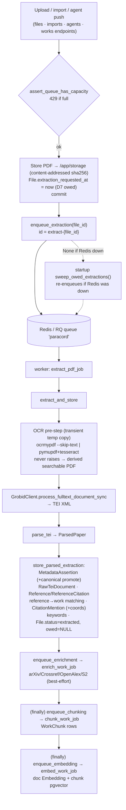

# 05 — Pipelines & Workers

[← API surface](04_api_surface.md) · [Local agent →](06_agent_protocol.md)

This is the asynchronous processing spine: how a PDF becomes a searchable, cited, embedded paper.
Source: `app/workers/{jobs,queue,supervisor,recovery}.py` and the extraction/embedding services.

---

## 1. The ingestion pipeline end to end



**The automatic chain is `extract → enrich → chunk → embed`.** Topics, keyword re-runs, and scope
summaries are **manual/admin only** (not in the auto chain).

### Stage-by-stage

**A · Enqueue (endpoint).** Every job-creating request first calls `assert_queue_has_capacity(db)`
(D39), stores the PDF on the shared `/app/storage` volume, sets `File.extraction_requested_at` (the
**D7 durable "owed" marker**), commits, then calls `enqueue_extraction`. If enqueue returns `None`
(Redis down), the row is already committed with the owed marker, so the startup sweep recovers it.

**B · `extract_pdf_job`** (`workers/jobs.py`, wrapped by `@_audited_job` → job.started/completed/
failed events): load `File` → `extract_and_store` → on success `status="extracted"`,
`extraction_requested_at=NULL`, discard-after-extract for `index_and_extract` uploads, commit, then
`enqueue_enrichment`. On a DOI unique-violation it records `metadata.doi_conflict` and marks
`extract_failed`. `_mark_failed()` rolls back and clears the owed marker so a *permanently* failing
file is not re-swept (no poison loop).

**C · GROBID** (`extract_and_store`): validate the path against configured roots
(`resolve_backend_readable_pdf_path`), read OCR config, run the OCR pre-step, POST to
`{GROBID_URL}/api/processFulltextDocument` (120 s timeout, consolidation + `teiCoordinates` flags).

**D · OCR pre-step** (`ocr.py`): `_text_layer_quality` classifies the file; `_resolve_ocr_engine`
picks `ocrmypdf`/`pymupdf`/none from backend + availability + quality (or `force_ocr`). OCR runs
into a temp dir and the searchable copy feeds GROBID; the derived copy is saved under
`derived_ocr/<sha[:2]>/<sha>.pdf` (never pollutes the content-addressed original). **OCR never fails
extraction.**

**E · TEI parse** (`tei_parser.parse_tei`): `ParsedPaper` with title/abstract/doi/venue/year/authors,
references (kept only if they have raw_citation/title/doi), and in-text mentions with
context + `pdf_coordinates`.

**F · Persist** (`store_parsed_extraction`): provenance-aware. Every value → `MetadataAssertion`;
canonical promotion **only when `not user_confirmed` and the field is empty**; raw TEI stored;
references/mentions rebuilt idempotently (delete this work's edges → `find_or_create_reference` per
ref → add `ReferenceCitation` → prune orphan `Reference`); `run_matching_for_references` resolves
`resolved_work_id` **before** mentions so a mention inherits it; keywords computed inline. Then the
**reverse-rescan**: still-external references and cached citing papers elsewhere in the library are
re-matched against THIS work (it may have just gained the title/DOI they cite).

**G · Enrichment** (`enrich_work_job`): best-effort external metadata; when it promotes fields it
also reverse-rescans references + citing papers (identifiers often first arrive here); in a
`finally` block (runs even on failure) enqueues chunking **then** embedding.

**H · Chunking** (`chunk_work_job` → `chunking.rechunk_work`): delete + rebuild `WorkChunk` rows from
title/abstract/TEI sections; deterministic ⇒ idempotent.

**I · Embedding** (`embed_work_job`): `index_one_work` (doc-level baseline `Embedding` + pgvector
copy) and `embed_work_chunks` (chunk-level pgvector, **Postgres + a registered model column only**).

**J · Topics / summaries** (manual/admin): `topic_work_job`, `keywords_work_job`.
`summarize_scope_job` and `topic_model_job` are currently **no-op stubs**.

## 2. The job queue

```mermaid
flowchart LR
    subgraph api["api container"]
        endpoints -->|enqueue_* (best-effort, returns None on failure)| Q
    end
    Q[("Redis · RQ queue 'paracord'<br/>default_timeout=900s")]
    subgraph worker["worker container"]
        sup["supervisor<br/>python -m app.workers.supervisor"]
        sup -->|wait_for_migrations (≤300s)| ok
        ok -->|"resolve_worker_count() once at startup"| fork["fork N × rq worker"]
        fork --> c1["rq child 1"]
        fork --> c2["rq child 2 … N"]
        sup -->|"restart on death (2s poll)"| c1
    end
    Q --> c1 & c2
```

- **Redis + RQ**, single queue `paracord`. Redis/RQ imported lazily so the module loads without a
  live Redis.
- **Idempotency via deterministic job ids**: `extract-{file_id}`, `{prefix}-{work_id}` for
  enrich/embed/chunk/topic/keywords, fixed `bm25-rebuild`/`reference-rescan-all`. `_live_job_id`
  no-ops an enqueue if a live job with that id already exists — this is what stops the recovery
  sweep and a manual re-extract from racing into two jobs.
- **Supervisor** (`workers/supervisor.py`): waits for the DB to reach Alembic head, reads
  `rq_worker_count` **once at startup**, forks that many `rq worker` children, restarts any that die,
  SIGTERM-drains with a 10 s grace. **Changing worker count needs a container restart.**
- **Backpressure (D39)**: `assert_queue_has_capacity` → 429 when pending depth ≥ `max_queue_len`
  (default 1000); fail-open unless `production_require_redis` → 503.
- **Rate limiting (D1)**: `rate_limit.py` ASGI middleware, two Redis fixed windows; `max_batch_items`
  caps a single import batch.

## 3. Failure & recovery

| Mechanism | What it does |
|---|---|
| **Transient-extraction retries (F2)** | `GrobidUnavailableError`/`OperationalError` are *transient*: the job keeps the owed marker and re-raises, so RQ `Retry(max=2, interval=[15,60])` re-runs it automatically. Terminal failures (DOI conflict, corrupt PDF) zero `retries_left` so RQ doesn't re-run GROBID, but still raise → visible in the failed-jobs list. A durable `File.extraction_attempts` (cap `MAX_EXTRACTION_ATTEMPTS=3`) bounds retries across restarts; a user re-extract resets it. |
| **Owed-extraction sweep (D7)** | On API startup and via `POST /jobs/reprocess-pending`, `sweep_owed_extractions()` re-enqueues files with `extraction_requested_at` set and `extraction_attempts` below the cap (idempotent; self-healing via the live-job guard, so no durable "extracting" status is needed). Skips if Redis unreachable. |
| **Downstream recovery sweep (F2)** | `sweep_owed_downstream()` (same triggers) derives owed work from state — an *extracted* file with **zero `WorkChunk`** → re-enqueue chunking; extracted with **no `Embedding`** → re-enqueue embedding — so a crash/flap between stages can't leave a paper un-indexed. |
| **Stuck-job recovery** | `queue.recover_stuck_jobs` (`POST /jobs/reset-workers`) requeues jobs stranded in the `StartedJobRegistry` (worker died mid-job) and clears the `FailedJobRegistry`. |
| **Loud non-recovered stages (F2)** | enrich/keyword/topic aren't auto-recovered (by decision) but fail loudly: a failure sets a per-paper `Work.processing_error` (a "processing failed" badge) on top of the `job.failed` audit + failed-jobs list. |
| **Admin helpers** | `clear_jobs`, `empty_queue`, `queue_status` (counts, worker count, recent jobs enriched with paper title/sha + RQ `retries_left`). |

The extract → enrich → chunk → embed chain is still linked by fire-and-forget enqueues, so the
downstream sweep (not a per-stage owed marker) is what closes the "worker died between stages" gap;
enrichment itself is best-effort and intentionally not auto-recovered (a missed enrich is a manual
"Enrich" click away, and a hard failure now shows on the paper).

## 4. OCR, embeddings, and chunking specifics

- **OCR backends** (`AIConfig.ocr_backend`): `none` / `ocrmypdf` (default, bounded subprocess,
  `--skip-text` idempotent) / `pymupdf` (rasterize@300dpi + tesseract). `ocr_language` in tesseract
  syntax (`eng+spa`). No ML-extraction (Nougat/Marker) seam.
- **Embedding providers**: hash-BOW (default, 256-dim, no download/egress), sentence-transformers
  (`all-MiniLM-L6-v2`, 384), Ollama (`nomic-embed-text`, 768). Any failure degrades to hash-BOW.
  Weights memoized once per worker process (`_PROVIDER_CACHE`) → **N children hold N copies in RAM**.
- **pgvector chunk columns** (`chunk_embeddings`, Postgres-only): `CHUNK_MODEL_COLUMNS`
  (`vec_minilm`/384, `vec_nomic`/768; dynamic registry authoritative). New models auto-provision a
  column + HNSW index via runtime DDL (slug/regex guarded).
- **Batch sizes**: reindex/backfill use `EMBED_BATCH_SIZE=64` with periodic commits
  (`commit_every` 50/200) so a flap keeps progress. ⚠️ the per-work `embed_work_chunks` path is
  **one embed call per chunk** (many HTTP round-trips for Ollama on a large paper).

## 5. Efficiency at scale (summary — full analysis in [09](09_efficiency.md))

- Single **GROBID** container is the shared throughput bottleneck (a per-PDF 120 s-timeout sync
  call); raising `rq_worker_count` parallelizes extraction only up to GROBID's capacity.
- **OCR** is the heaviest per-file CPU step (page rasterization); bounded by a timeout.
- `rescan_reference_matches_job` also rematches every cached `ExternalPaper` (incoming direction).
- `scan_duplicates_job` and `rescan_reference_matches_job` load the **entire corpus** into one
  transaction (O(N) memory, one big commit) — will not scale to a large library without pagination.
