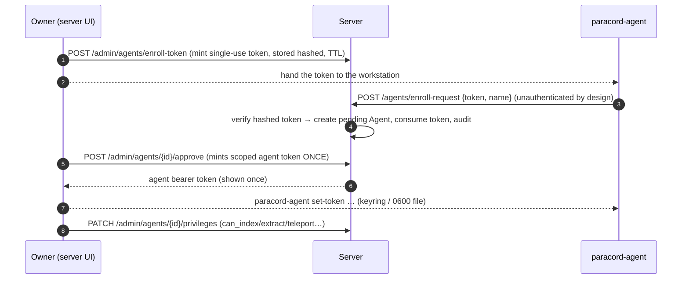
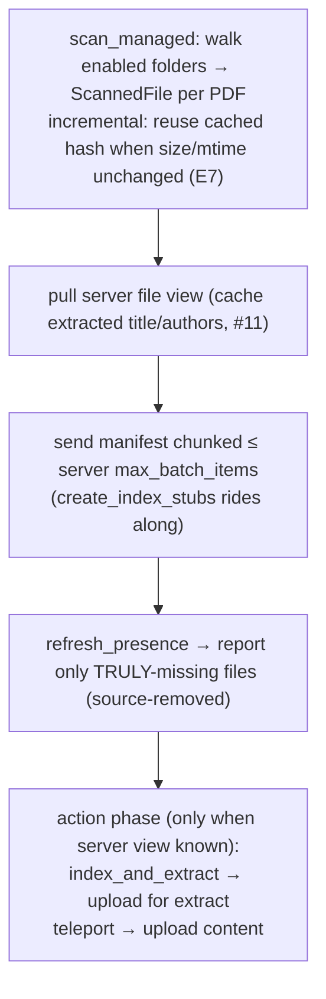

# 06 — Local Workstation Agent

[← Pipelines & workers](05_pipelines_workers.md) · [Frontend →](07_frontend.md)

The agent is a standalone Python package `paperracks_agent` (the `paracord-agent` command) that runs
on a workstation owning local PDFs — possibly a different machine from the server. It indexes managed
folders/files, reports a manifest of **opaque content-hash IDs**, and applies a per-item import
action. **Core guarantee: the server never learns any workstation filesystem path.** It addresses
files only by `local_file_id` (= the file's SHA-256); the agent resolves an ID back to a real path
**locally only**, re-checking the path is still inside a configured root.

---

## 1. Module map (`agent/paperracks_agent/`)

| Module | Responsibility |
|--------|---------------|
| `cli.py` | argparse CLI: `enroll`, `set-token`, `set-server`, `add-folder`/`add-file`, `remove`, `list`, `scan`, `status`, `sync`/`refresh`, `start`, `reconcile`, `prune-unwatched`, `forget`, `teleport`, `request`, `web up\|down\|status`. |
| `config.py` | pydantic `AgentConfig` persisted as YAML at `~/.config/paracord/agent.yaml`. Real keys: `server_url`, `refresh_interval` (30 s), `folders`/`files`, `web_port` (8765), `default_action` (`index_only`), `default_teleport_policy` (`ask`), `follow_symlinks`, `auto_prune_unwatched`, `create_index_stubs`. |
| `secrets.py` | Server bearer token + web token in the OS keyring, else a `0600` JSON file (atomic write). Precedence: arg → `$PARACORD_AGENT_TOKEN` → stored. |
| `state.py` | Durable SQLite index at `~/.local/share/paracord-agent/state.sqlite3` (`0700`/`0600`, WAL). Maps `local_file_id` → real path (**local-only**), sha256, size, mtime, action, processing_state, extracted title/authors. Idempotent migrations; corrupt DB moved aside + recreated. |
| `manifest.py` | `build_manifest_item` streams SHA-256 (1 MB chunks); `local_file_id == sha256` (stable, path-free); `display_path` = filename only. |
| `index.py` | In-memory `AgentIndex`; `resolve_path` rejects unknown IDs + re-checks root containment (symlink/TOCTOU defense). |
| `watcher.py` | `iter_pdf_files` globs `*.pdf` under canonicalized roots (poll-based, **not** inotify). |
| `security.py` | `canonicalize_allowed_root`, `is_path_within_roots` (non-strict resolve + `relative_to`). |
| `teleport.py` | `open_file_for_teleport` opens a file resolved **only** via `local_file_id` — no server-path code path exists. |
| `agent_ops.py` | Coordination shared by CLI + web GUI: scan/sync/reconcile/fulfil/prune. |
| `client.py` | HTTP client to the server agent API (bearer agent token). |
| `web.py` / `web_server.py` | Loopback-only, token-gated local web GUI. |

## 2. Enrollment (owner-gated)

The enrollment endpoint is unauthenticated **by design** — it is gated by the single-use, hashed,
TTL'd enrollment token. Every authenticated call thereafter carries `Authorization: Bearer <agent
token>`; `require_agent_token` matches `Agent.token_hash` and requires `status=="approved"`.

## 3. Scan → manifest → action cycle

`cli.py start` loops `agent_ops.sync` every `refresh_interval` seconds (config reloaded each cycle so
edits apply live; systemd hosts it — there is **no `serve` command** and no working daemon flag).

Import actions per managed item:
- **`index_only`** — only the opaque reference + metadata reach the server; the PDF stays local.
- **`index_and_extract`** — PDF uploaded, extracted, then **discarded** server-side (reference +
  metadata + short preview kept; re-teleportable later).
- **`teleport`** — PDF uploaded and **kept** in the server's managed library.

## 4. Teleport & the agent↔server protocol

Teleport = copying a PDF into the server's managed store, content-addressed and **hash-verified**
(server recomputes SHA-256 and compares to the manifest; mismatch → refused + audit).

| Client method | Endpoint (`/api/v1/agents`) | Privilege | Notes |
|---|---|---|---|
| `enroll` | `POST /enroll-request` (202) | none | owner-token enrollment |
| `send_manifest` | `POST /manifest` (202) | `can_index` | `ingest_manifest`, `create_stubs` |
| `get_pending_teleports` | `GET /teleports/pending` | — | |
| `upload_teleport_content` | `POST /teleports/{id}/content` (201) | `can_teleport` | queue-cap + 200 MB + `%PDF` + openable + hash-verified |
| `upload_for_extraction` | `POST /files/{id}/extract` (201) | `can_extract` | extract then discard PDF |
| `offer_teleport` | `POST /files/{id}/offer-teleport` (201) | `can_teleport` | agent-initiated |
| `reject_teleport` / `unblock_teleport` | `POST /teleports/{id}/reject\|/unblock` | — | `--forever` blocks |
| `get_me` | `GET /me` | — | identity + privileges + `max_batch_items` |
| `get_my_files` | `GET /files` | `processing_visibility` | includes extracted title/authors |
| `report_source_removed` | `POST /files/source-removed` | — | flags vanished sources |
| `known_hashes` | `POST /files/known-hashes` | — | content-aware reconcile |

`POST /agents/register` is a **410 Gone** deprecated stub. The server-side counterpart is
`services/agent_files.py` (+ `services/agents.py`); `services/agent_protocol.py` is a **vestigial
stub** whose `validate_agent_file_id` always returns `False`.

Teleport policy governs *server-initiated* requests: `ask` (explicit approve/reject) vs `allow`
(auto-fulfil). `reconcile` (reverse sync) un-indexes files the server no longer has, content-aware
via `known-hashes` so deleting a duplicate record whose PDF survives under the canonical paper
doesn't un-index the still-present local file.

## 5. Security boundaries (see also [08 — Security §Agent boundary](08_security.md#83-file-access-boundaries))

- **Server never gets a path**; opaque-ID resolution is local-only + root-checked (symlink/TOCTOU
  defense). An ID the agent never indexed raises `KeyError` — a compromised server cannot coax the
  agent into reading arbitrary files.
- **Secrets** in keyring or `0600` file (atomic write); SQLite state `0600` (it maps every real
  path).
- **Local web GUI** binds `127.0.0.1` only, gated by a per-launch `token_urlsafe(24)` token
  (httponly, `samesite=strict` cookie); runtime file at `0600`. It is allowed to browse the agent's
  own filesystem (folder picker) precisely because it is loopback + token-gated.
- **Delete-on-disk guards (reconcile)** are triple-locked: file must resolve strictly inside a
  currently-enabled watched folder; a one-shot `arm` flag (CLI requires `--delete-on-disk` +
  `--confirm-delete`); a run touching > `MAX_DELETE_ON_DISK=100` files refuses entirely. Deletes move
  to a recoverable timestamped trash dir — never hard-unlink. Forward auto-prune is **off by
  default**; a purely-local never-pushed `index_only` file can never be silently dropped.

## 6. Agent revision flags (see [§11](11_future_and_revision_notes.md#agent))

1. **`config/agent.example.yaml` documents a schema the real `AgentConfig` does not use** (wrong
   keys) — hand-editing it has no effect. High-value doc fix.
2. **`systemd/paperracks-agent.service.example` is broken** — invokes a non-existent `serve` command
   with a non-existent `--config` flag.
3. Web GUI token compare uses `==`, not `secrets.compare_digest` (timing side-channel; low risk on
   loopback).
4. Monitoring is polling only despite the "watcher" naming; latency bounded by `refresh_interval`.
