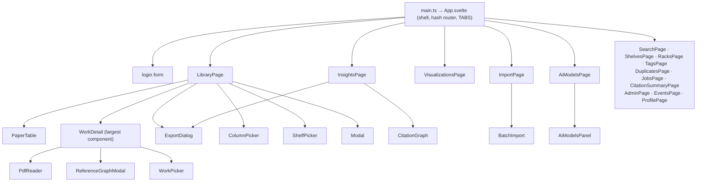

# 07 — Frontend

[← Local agent](06_agent_protocol.md) · [Security →](08_security.md)

The web UI is a **Svelte 5 + Vite 8 + TypeScript 6** single-page app under `frontend/src`. It is
served separately from the API (Vite dev on `127.0.0.1:5173`, nginx in prod) and talks to the
backend over CORS at `/api/v1`.

> Components are written in the **Svelte 4 dialect** (`export let`, `$:`, `on:click`, slots) even
> though the app boots via Svelte 5's `mount()` API — no runes. Heavy deps (`cytoscape`+`fcose`,
> `echarts`, `pdfjs-dist`) are all **lazy-loaded**.

---

## 1. Boot & shell

- **`main.ts`** calls `initTheme()` then `mount(App, {target:'#app'})`. `index.html` has an inline
  script that pre-sets `data-theme` + a cached background so there is no boot flash.
- **`App.svelte`** is the whole shell: **hash-based routing, no router library.** A `TABS` array
  drives nav with per-tab role gating; arrow keys cycle tabs. **Tab caching (#9)**: panels lazy-mount
  on first visit and stay mounted (`hidden` toggled) so state survives switches; hidden pages get a
  `visible=false` prop to pause work. The auth token lives in `localStorage['paracord_token']`; a
  reactive `ApiClient` is recreated on token change; global toasts fire for `queue-full` and
  session-ended; a Jobs badge polls `getJobs(1)` every 20 s.

## 2. Component hierarchy



Every page takes `client: ApiClient` (some also `visible`). `WorkDetail` is the biggest component
(metadata review, files, references, summaries, topics, keywords, find-on-web, merge/unmerge, citing
papers). `PaperTable` is the reusable sortable/selectable table.

## 3. API client (`src/api/client.ts`, ~3160 lines)

A single `ApiClient` class + **all shared domain TypeScript interfaces** (the single type source for
the app: `Work`, `Shelf`, `Rack`, `Tag`, graph/viz/citation-summary/import/admin types).

- Base URL `import.meta.env.VITE_API_BASE_URL ?? 'http://127.0.0.1:8000'`; all routes `/api/v1/...`;
  **no dev proxy** (direct cross-origin → relies on backend CORS).
- Private `request<T>()` adds the bearer header, stringifies bodies, applies an optional
  `AbortSignal.timeout` on polling calls, extracts `payload.detail`, and centralizes:
  **401 → `onUnauthorized` (logout)**; **429/503 matching `/queue is full/i` → `onQueueFull`**
  (phrase-keyed so ordinary rate-limit 429s don't fire it); `204 → undefined`.
- Raw-fetch helpers bypass the JSON path for multipart/streaming/blobs (`uploadWorkFile`,
  `uploadPdf`, `uploadPdfsMulti`, `streamFindOnWeb` NDJSON reader, `getFileBlob`), each
  re-implementing auth + 401.

⚠️ Two client flags to know: `actOnReference` likely **double-stringifies** its body (passes
`JSON.stringify({action})` where `request()` also stringifies) — probable bug; and the raw-fetch
upload/stream helpers do **not** surface `onQueueFull`. See [§11](11_future_and_revision_notes.md#frontend).

## 4. State management

No global framework — plain `svelte/store` in `src/lib/`:
- **`session.ts`** — `currentUser` + derived role gates (`canEdit`, `canManagePapers`, `isEditor`,
  `isLibrarian`, `isAdmin`, `isOwner`), `canModifyWork(user, work)` mirroring the backend rule,
  `ROLE_RANK`.
- **`selection.ts`** — cross-tab: `selectedWorkId/ShelfId/RackId`, `selectedPaperIds`, plus one-shot
  command stores (`pendingLibrarySearch`, `pendingLibraryOpen`, `pendingImportText`) used as a
  consume-then-reset event bus.
- **`theme/store.ts`** — theme stores (below).

Reactivity via `$:`; state mostly component-local (props down, callbacks up). Column prefs persist to
localStorage immediately + to the backend debounced (600 ms).

> **Role gating in the UI is advisory only** — a convenience mirror of the backend. The backend is
> the source of truth for every gated action (see [08 — Security](08_security.md)).

## 5. Theming

YAML themes are compiled at build time (`scripts/build-themes.mjs` → `themes.generated.ts`). Each
theme has a `tokens` block (`surface/ink/border/accent/status`) injected as CSS custom properties,
and a `graph` block (categorical palette validated for CVD-safety + contrast, node/edge/label
colors). `store.ts` holds `activeThemeId`/`activeTheme`/`activeVizTheme`/`followSystem`. Boot priority
(no flash): localStorage cache → server `theme` (from `/auth/me`) → default. **Live re-styling** —
Cytoscape/ECharts re-read the resolved theme on `$activeThemeId` change without a rebuild. Owner/admin
custom themes (uploaded YAML) merge into everyone's picker. Full operator guide:
[`docs/runbooks/features.md`](../runbooks/features.md).

## 6. Notable UI features

- **PdfReader (~1400 lines)** — PDF.js lazy-loaded; Paper/References/Notes tabs; paged vs scroll
  view (IntersectionObserver lazy render); reading modes original/dim/dark applied as a CSS filter on
  the canvas only (text-selection layer keeps true colors); clickable citation overlay boxes +
  annotation highlights (`lib/reader/overlayBoxes.ts`) tracked across zoom; whole-document search with
  a scanned-PDF fallback (fetch server OCR text when the native layer is sparse); selection →
  annotation mapping to GROBID-style scaled coords; bidirectional citation↔reference navigation.
  ⚠️ the PDF is fully buffered (`.arrayBuffer()`) — large scans load entirely into RAM.
- **CitationGraph (~740 lines)** — Cytoscape + fcose. Citation (directed) vs Topic (similarity)
  graph; Graph vs List modes. Controls: node mode, collapse-versions, size-by
  (degree/PageRank/betweenness — live restyle), color-by (this one **refetches**), hide-singletons/
  external. Perf (D17): a topology signature decides rebuild-vs-restyle; filters just show/hide.
  Themed from `VizTheme.graph`; tap local → open, tap external-with-DOI → import.
- **ExportDialog** — legacy (`onExport(format)`) vs rich (`fetchExport` → preview/copy/download). 10
  formats; `styled` reveals a CSL style dropdown.
- **PaperTable + LibraryPage** — `table-layout:fixed`, column registry (`lib/columns.ts`,
  `LIBRARY_COLUMNS`), sortable headers, multi-select; LibraryPage adds a resizable two-pane split
  (persisted %), lucene-ish filters + search modes (metadata/semantic/hybrid), saved filters,
  server-controlled pagination (D18) with client sort for semantic/hybrid (capped 50 ranked ∩ 500
  filtered), and batch ops with bounded concurrency (`runBatched`, chunks of 6, `Promise.allSettled`).
- **Visualizations registry (`lib/viz/registry.ts`)** — `view_type → VizRenderer` with pure
  `buildOption(payload, theme)` (never imports echarts, so jsdom-unit-testable). Five renderers:
  temporalMap (default), embeddingCluster, coCitation, topicRiver, similarityHeatmap.

## 7. "Paper" (UI) vs "Work" (code)

Deliberate and pervasive. **Code side**: `Work`, `WorkQuery`, `PaginatedWorks`, `selectedWorkId`,
`listWorks`/`getWork`/`mergePaper`, `/api/v1/works/...`, `canModifyWork`. **UI side**: "+ New paper",
"Untitled paper", "{n} papers", `papers_per_page`. `selectedPaperIds`/`pendingLibraryOpen` bridge the
two. When adding UI strings use "paper"; when adding code use "work" — never rename the code
identifiers.

## 8. Build & test

```bash
make frontend-install     # npm ci
make frontend-dev         # Vite dev server on 127.0.0.1:5173
make frontend-test        # Vitest (extensive: colocated *.test.ts across components/pages/lib)
make frontend-build       # prebuild themes → vite build
make frontend-check       # tests + build
```

The test suite is unusually thorough — nearly every component and lib module has a colocated
`*.test.ts`, plus `future/` acceptance-contract tests.
