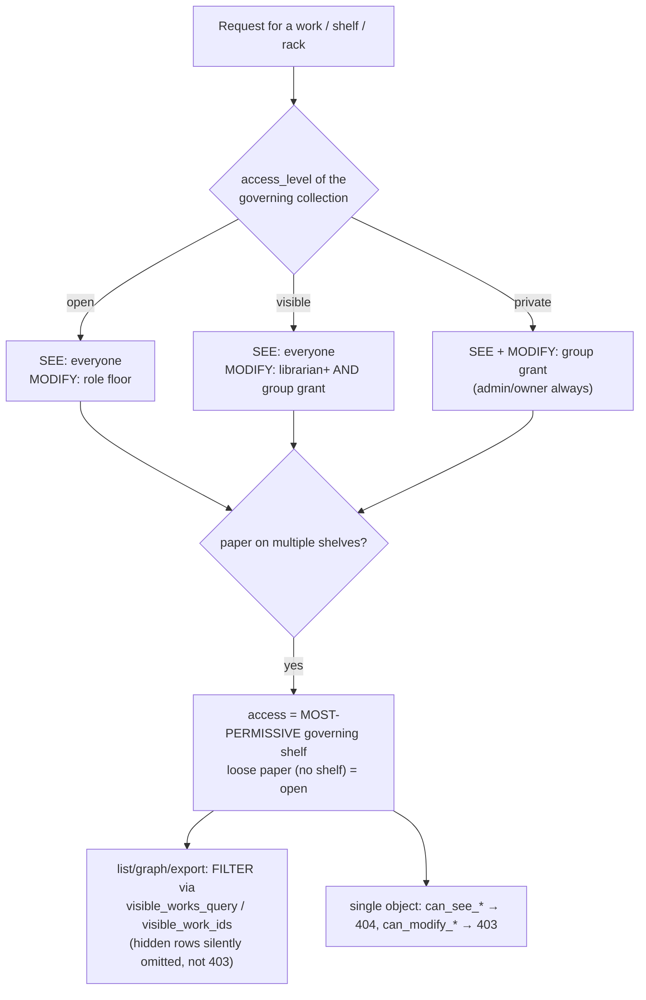

# 08 — Security

[← Frontend](07_frontend.md) · [Efficiency →](09_efficiency.md)

PaRacORD is threat-modeled for a **local-first, mostly-single-user, few-LAN-users** deployment.
Findings are weighted to that scale. The posture is strong and explicitly tested: filter-not-403
list ACLs, fail-closed SSRF, content-addressed file access with symlink-safe containment, hashed
tokens, and an adversarial safety test battery that documents the intended model.

Key sources: `core/security.py`, `services/{auth,users,access,file_paths,web_find,tei_parser,
login_throttle,rate_limit}.py`, `api/deps.py`, `models/{user,session,group,access_settings}.py`,
`SECURITY.md`, `docs/runbooks/secrets_management.md`, and `backend/tests/safety/*.py`.

---

## 8.1 Authentication (AuthN)

- **Password hashing** (`core/security.py`): the maintained `bcrypt` library directly (passlib
  dropped). `hash_password` rejects empty and > 72-byte passwords (bcrypt's hard limit — *enforced*,
  not silently truncated, closing the "only first 72 bytes matter" bypass). Stored only as a one-way
  hash in `User.password_hash`; never logged, never returned.
- **Sessions** (`services/auth.py`): bearer tokens are `secrets.token_urlsafe(32)`; the **raw token
  is returned once**, and the DB stores only `sha256(token)` in `UserSession.token_hash` (unique,
  indexed). Revocable (`revoked_at`) and expiring (`expires_at`, TTL 720 min default).
  `require_authenticated_user` re-checks on **every request** that the user exists and is not
  disabled, so disabling takes effect immediately even with a live token.
- **Change/reset**: `change_password` verifies the current password, enforces ≥8 chars and
  difference; self-service change revokes **other** sessions. Admin `reset_user_password` revokes
  **all** the target's sessions.
- **Login throttling** (`login_throttle.py` + the `auth.login` endpoint): per-username sliding
  window; after `login_max_failures` within `login_lockout_minutes` → **429 + Retry-After** +
  `auth.login_locked` audit. Account-enumeration is mitigated by a constant bcrypt verify against a
  cached dummy hash on unknown/disabled users.
- **Credential recovery is server-console only** (`scripts/reset_admin_password.py`): no
  unauthenticated web reset endpoint exists (explicitly forbidden). Runs on the host with DB access,
  re-hashes, revokes all sessions, writes an audit event.

## 8.2 Authorization (AuthZ)

**Role ladder** (`core/security.py`): `reader < contributor < editor < librarian < admin < owner`.
Unknown/legacy roles rank below reader (fail-safe). Guest/anonymous roles forbidden
(`assert_no_guest_roles` fails startup).

| Role | Capability |
|------|-----------|
| reader | read accessible content |
| contributor | + create/edit/delete **own** papers (`Work.created_by_user_id == self`) |
| editor | + edit/delete **any accessible** paper |
| librarian | + rack/shelf structure (subject to the grant matrix) |
| admin | full administration + **bypasses content ACLs**, except managing another admin or the owner |
| owner | single immutable bootstrap account; only account that may manage admins; never disabled/deleted/role-changed |

**Object-level access / IDOR protection** (`services/access.py`) — the heart of the model:

- Levels on racks/shelves: **open** (all SEE, role MODIFY), **visible** (all SEE, MODIFY needs
  librarian+ **and** a group grant), **private** (SEE and MODIFY need a grant; admin/owner always).
- **Multi-shelf rule**: a paper's access is its **most-permissive governing shelf**; a loose paper is
  `open`. Contributor may modify only own papers; editor+ any see-able paper.
- **Filter, don't 403**: list endpoints build SQL predicates (`visible_*_query`) so a reader's
  `GET /works` silently omits hidden rows; `visible_work_ids` returns `None` for admin/owner
  (unrestricted sentinel). **Merged shadows (`merged_into_id`) are clamped out of every path for
  everyone.**
- **Groups & grants**: every user gets an auto-managed **personal group** (name == username) seeded
  with admin-configured `DefaultGrant`s; `GroupGrant` attaches a group to a rack/shelf;
  `AccessSettings` holds the global default level + the Inbox shelf id.
- **Admin-vs-owner** (`services/users.py._guard_target`): nobody targets the owner; only the owner
  targets an admin; self-disable/self-delete blocked; delete is two-step; every change audited.

## 8.3 File-access boundaries

Only **two** location types are backend-readable (`services/file_paths.py`): `managed_path` (must
resolve under `managed_library_root`) and `server_path` (must resolve under the owning active
`server_folder` source's root). **No arbitrary path reads.** `_validated_path` does
`Path(uri).expanduser().resolve().relative_to(root)`, which defeats `../` traversal, absolute paths
outside the root, **and symlink escapes** (resolve follows the link to its real target, which then
fails containment). Derived OCR copies live under `derived_ocr/<sha[:2]>/<sha>.pdf` with a strict
64-char digest name. `resolve_streamable_pdf_path` validates the file's **own** location *before*
preferring a derived copy — closing a bypass where an out-of-root file could be served just because a
same-SHA derived copy exists.

**Agent boundary** ([06 — Agent](06_agent_protocol.md)): the agent reports only opaque identity
(`local_file_id` = SHA-256, display_path) — never a server-usable path. Teleport is content-addressed
and hash-verified. Agent tokens are stored hashed; enrollment tokens are single-use.

## 8.4 SSRF protection

The egress guard (`services/web_find.py`, `services/metadata_enrichment._get`) is **fail-closed**:

- `_ip_is_internal` blocks RFC1918, loopback, link-local (incl. `169.254.169.254` cloud metadata),
  reserved, multicast, unspecified — IPv4 and IPv6. Unparsable IP → unsafe.
- `_host_resolves_internal` resolves **all** A/AAAA records; if any is internal (or resolution
  fails/empty) the host is refused.
- Non-http(s) schemes (`file:`, `gopher:`, `ftp:`) are hard-blocked. A **shadow-library denylist**
  (sci-hub, libgen, annas-archive, …) always wins over any policy mode.
- `resolve_final_url` is the only cross-host redirect follower (DOIs legitimately redirect) and
  re-checks the SSRF + denylist + scheme guard **on every hop**; it never downloads a body.
  Downloads (`_stream_pdf`) re-classify each hop and enforce content-type + `max_bytes` + `%PDF`.
- The admin-set Ollama URL is validated by `ai_config._validate_ollama_url` (loopback + docker-
  service names allowed; LAN/public refused unless `allow_external_ollama`).

Policy modes: `restricted` (default) / `careful` / `unrestricted` — but the hard blocks are
unconditional. Enrichment carries only percent-encoded bibliographic identifiers (cannot alter the
target host).

## 8.5 XXE / XML-bomb protection

All TEI parsing goes through `lxml.etree.fromstring(bytes)` relying on lxml's safe defaults at a
**pinned version**. The safety tests are the guard-rail: local `file://` SYSTEM entities are not
resolved, network SYSTEM entities are not fetched, and a 10⁸ billion-laughs bomb returns safely
unexpanded. ⚠️ This depends on lxml's *implicit* defaults, not an explicit hardened parser — an lxml
bump that changed defaults would only be caught by `make test-safety`. Consider constructing an
explicit `etree.XMLParser(resolve_entities=False, no_network=True, resolve_dtd=False)`.

## 8.6 The safety test battery (the intended threat model)

Marked `@pytest.mark.safety`, excluded from `make test`/`test-full`, run via `make test-safety`. Each
file encodes a threat class:

| File | Asserts |
|------|---------|
| `test_safety_authz_idor.py` | Reader gets 404 on every surface for a hidden work; private scopes → 404; per-user isolation of worklist/import batches; **mass-assignment ignored** (`id`/`created_by_user_id`/`role`/`is_bootstrap` on create are server-owned) |
| `test_safety_privilege_escalation.py` | Role floors hold over HTTP; admin cannot touch another admin or the owner; self-escalation via profile impossible |
| `test_safety_path_traversal.py` + `test_ext_safety_filesystem_isolation.py` | `../`, absolute-outside, symlink escapes rejected `forbidden`; derived-OCR path rejects non-digest names; stream requires auth even for a known id |
| `test_safety_ssrf.py` | Internal/loopback/metadata IPs, bad schemes, shadow libraries, cross-host redirect escapes refused before any network call; ollama_url guard |
| `test_safety_xxe.py` | §8.5 |
| `test_safety_auth_session.py` | Token entropy/uniqueness/opacity (the stored hash is not a valid token), revoked/expired rejected, no token in URL/Location; agent-token invalid/unapproved/missing-privilege paths |
| `test_safety_rate_and_throttle.py` | Rate limiter + login throttle + queue cap trip at the cap and are **not bypassed by concurrency**; windows recover |
| `test_safety_sql_injection.py` | Search-query parser is an allowlist carrying values as bound params; the dynamic pgvector column name derives through a strict slug allowlist |
| `test_safety_upload_abuse.py` | Oversized → 413 (read bounded, decompression-bomb-safe); non-PDF/malformed/zero-byte/`%PDF`-but-unopenable → 400 |
| `test_safety_web_stability.py` | nginx CSP present (`default-src 'self'`, `object-src 'none'`, `frame-ancestors 'none'`, nosniff, Referrer-Policy); reads stay responsive under load |

## 8.7 Secrets handling

Three tiers (`SECURITY.md`, `docs/runbooks/secrets_management.md`): Tier 0 non-secret config via
`.env`/`config/*.local.yaml` (only `*.example` committed); Tier 1 machine secrets
(`PARACORD_SECRET_KEY`, DB/Redis/agent tokens) read from env, referenced by `*_env` name in YAML,
never inlined; Tier 2 passwords bcrypt-hashed, other recoverable data encrypted at rest. All bearer
tokens (session, agent, enrollment) stored only as SHA-256 hashes. Enforcement is automated:
`.gitignore` + `scripts/check_secrets.py` + a pre-commit hook + CI `secret-scan.yml`.

> **At rest today, the corpus is not encrypted** — usernames/emails and all bibliographic content sit
> in plaintext Postgres; `PARACORD_SECRET_KEY` is reserved for future Fernet field encryption and,
> when unset, the app runs without it. Corpus confidentiality relies on operator disk/volume
> encryption.

## 8.8 Residual risks (weighted for the LAN model)

Consolidated with severities in [§11 — Security flags](11_future_and_revision_notes.md#security).
The headline items:

1. **Rate limiter & login throttle fail *open* when Redis is down** *(Medium)* — set
   `PARACORD_PRODUCTION_REQUIRE_REDIS=true` on any instance exposed beyond fully-trusted users.
2. **Plaintext LAN transport by default** *(Medium)* — the SPA and agent default to `http://`;
   tokens (in `localStorage`) and PDFs traverse the LAN unencrypted. Front a reverse proxy with TLS.
3. **No at-rest corpus encryption** *(Low–Medium)* — depends on operator disk encryption.
4. **Hardcoded dev DB password as the code default** *(Medium)* — if `DATABASE_URL` is unset a real
   deployment silently uses a well-known password. Fail closed outside development.
5. **XXE safety depends on implicit lxml defaults** *(Low)* — pin an explicit hardened parser.
6. **`topic_graph` visibility depends on the caller passing `visible_ids`** *(audit item)* — verify
   every endpoint that builds it clamps to the actor's visible set.
7. ✅ **RESOLVED (F1)** — `export_service` no longer injects user `citation_keys` verbatim; they're
   sanitised (structural chars neutralised, Unicode/`. : + / _ -` preserved) and de-duplicated.

Run `make test-safety` before shipping anything touching auth, access control, file access, or
egress; run it where the nginx config is reachable so the CSP test doesn't silently skip.
