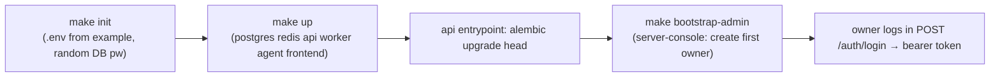
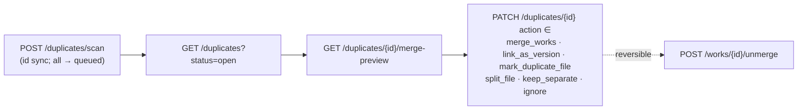

# 10 — User Workflows Manual

[← Efficiency](09_efficiency.md) · [Future & revision notes →](11_future_and_revision_notes.md)

End-to-end guide to how PaRacORD is used. Every path is under `/api/v1`; role floors are from
`api/deps.py`. Where a runbook and the code disagree, **the code wins** — e.g. the agent CLI
subcommand is `enroll` (not the older runbook's `register`; `POST /agents/register` is a 410 stub).

---

## 3.1 First run & bootstrapping the owner



1. `make init` copies `.env.example` → `.env` and generates a random DB password.
2. `make up` starts the stack; the API auto-applies migrations (`make migrate` to force).
3. `make bootstrap-admin` runs `scripts/bootstrap_admin.py` in the API container: prompts for
   username + password (no echo), refuses if any owner or that username exists, creates
   `User(role=OWNER, is_bootstrap=True)` with a bcrypt hash, writes a bootstrap audit event, creates
   the owner's personal group + default grants.
4. Owner logs in via `POST /auth/login` (failures throttled → 429 + Retry-After).
5. Recovery: `make reset-admin-password` re-hashes, revokes sessions, audits.

## 3.2 Add papers

All import endpoints check queue capacity first (`assert_queue_has_capacity`, 429 if full); **editor**
floor unless noted.

| Way in | Endpoint | Notes |
|--------|----------|-------|
| Single PDF | `POST /imports/upload` (multipart, opt `target_shelf_id`) | 200 MB cap + `%PDF` magic + openability probe; content-addressed dedup; mints Work+File+ImportBatch; sets owed marker; enqueues extraction |
| Multi-PDF staging | `POST /imports/upload-multi` (`mode=preview\|direct`) | extract-before-store; poll `GET /imports/staging/{id}` → `ready` (TEI preview + detected duplicates) → `POST .../commit` (commit itself is contributor floor) |
| By identifier | `POST /imports/identifier` (`doi\|arxiv`) | idempotent; mints a metadata-only Work; `enrich_work` pulls external metadata |
| Bibliography | `POST /imports/bibtex\|/ris\|/csl` (pasted) | maps entries → Works + author assertions |
| Batch raw citations | `POST /imports/batch/preview` (`engine=lookup\|grobid`) → `POST /imports/batch/commit` | **contributor** floor (not editor); preview writes nothing (no queue-capacity check either) and confirm to commit |
| Server folder | owner `POST /admin/import-roots` → editor `POST /sources/server-folder` → `POST /imports/folder` | imports PDFs **in place** (no copy) |
| Agent teleport | see [§3.11](#311-multi-user--lan-setup) + [06 — Agent](06_agent_protocol.md) | opaque-id manifest → request → hash-verified push |

## 3.3 Extraction pipeline (user's view)

Automatic on every PDF import; manually (re)triggered via `POST /files/{id}/extract`,
`POST /works/{id}/extract`, or `POST /works/{id}/enrich`. Progress shows via the file `status`/badges
and the **Jobs** tab. The chain: OCR (if needed) → GROBID → metadata + references + in-text citation
contexts + raw TEI → arXiv/Crossref enrichment → chunking → embedding. Full mechanics in
[05 — Pipelines](05_pipelines_workers.md).

## 3.4 Organize: shelves, racks, tags

- **Shelves** hold papers; **racks** hold shelves; both are many-to-many, and both carry an
  `access_level`. `GET/POST/PATCH/DELETE /shelves` and `/racks` (create+ = **librarian**);
  membership via `/{id}/works` and `/{id}/shelves`. The default/Inbox shelf can't be deleted, and
  orphaned papers fall back to it (invariant: every work is on ≥1 shelf).
- **Tags** are global labels: `GET/POST /tags` (create-or-return, contributor+), `DELETE` (editor+),
  attach/detach via `/{id}/links` (needs modify on the target). Tags can be hierarchical
  (`parent_tag_id`). Tags can also be scoped to specific shelves/racks (`PUT /tags/{id}/scope`,
  contributor+); an unscoped tag stays global. `GET /tags/assignable?work_id=` lists the tags
  offered for a given paper (global ones plus those scoped to a shelf/rack the paper is on).
- "Where is this paper?" → `GET /works/{id}/shelves`.

## 3.5 Search: keyword, semantic, hybrid

- **Library filter** `GET /works`: structured operators (`author:`, `year:>=2020`, `venue:`,
  `tag:`, `type:`, `doi:`, `arxiv:`, `cites:`, `cited_by_local:`, `has:pdf|references|…`), free text
  over title/abstract/DOI/arXiv/venue, sha256 lookup; allowlisted sort + server-clamped pagination.
- **Ranking search** `POST /search`: `mode ∈ lexical | semantic | hybrid` (default hybrid = BM25F+ ⊕
  dense via RRF); optional `embedding_model` (or `multimode`); per-item `relevance` + honest
  `degraded`/`provider_used`. `POST /search/semantic` for chunk-level; `POST /search/warm` rebuilds
  the in-memory BM25F+ index (any authenticated user; not currently auto-called by the frontend on
  library open); `POST /search/reindex` (editor, queued).
- All results are SEE-clamped to the actor's visible works.

## 3.6 Duplicate detection & resolution



Candidates are only produced by an explicit scan (single-work/-file scans run inline; a full-library
scan — no `work_id`/`file_id` — always runs on the background worker). Merges are **reversible** (a
shadow is restored on unmerge). Candidates touching a hidden work are filtered from the list.
Scan/preview/apply need **editor**.

## 3.7 Citation graph & summaries

Scopes: `library | shelf | rack | search_result | selected_papers | import_batch | saved_filter`,
each SEE-gated + visible-clamped.

1. `POST /graphs/citation` — works + citation edges (`node_mode`, `collapse_versions`, `color_by`;
   degree/PageRank/betweenness precomputed) → Cytoscape.
2. `POST /graphs/topic` — embedding-similarity kNN graph.
3. `GET /works/{id}/reference-graph` — per-paper reference/citing scatter graph (base paper + one
   node per reference, local vs external; `include_ref_edges` adds local ref→ref links,
   `include_citing` adds external citing papers); edges are colour-coded by relation to the base
   paper (reference / citing / ref↔ref) in the frontend `ReferenceGraphModal`.
4. `GET /citations/summary` — most-cited local/external, missing, bridge, isolated, chronological,
   coverage (cached by scope signature).
5. `GET /citations/venue-author-summary`; `GET /citations/external-preview` (identifier-only egress).
6. Missing-work worklist `GET/PUT/DELETE /citations/worklist`; `GET /citations/missing-export`
   (bibtex/csv); import a missing ref via `POST /works/from-reference/{reference_id}`.

## 3.8 Export

- `GET /exports/styles` (CSL: APA/IEEE/Chicago/MLA/Harvard/Vancouver/Nature).
- `POST /exports` (scope or `work_ids`; formats BibTeX, BibLaTeX, RIS, CSL-JSON, Markdown, HTML,
  plain bibliography, `styled`, latex, pandoc). Reader+ may export; only see-able papers are included.
- `GET /citations/missing-export`; `GET /works/{id}/annotations/export`.

## 3.9 AI summaries, topics, keywords

Providers default to dependency-free baselines (hash-BOW embeddings, extractive summaries, TF-IDF
topics); heavier engines are opt-in from **Admin → AI & Models** (owner-or-admin, per `require_admin`).

1. Admin config: `GET /admin/ai/status`, `PUT /admin/ai-config` (changing the embedding model
   auto-queues a reindex), `POST /admin/ai/models/pull|validate`, `/reindex`, `/lexical-rebuild`,
   `/keywords|topics/batch`. Ollama via `make up-ai`.
2. Per-paper summary `POST /works/{id}/summaries` (`auto|extractive|local_llm`, degrades gracefully).
   `detail ∈ short | detailed_fast | detailed_section | detailed_deep` (`detailed` is a back-compat
   alias for `detailed_deep`) trades cost for granularity — `detailed_fast` groups sections into
   ≤4 LLM-categorized buckets, `detailed_section` is one call per top-level (coalesced) section,
   `detailed_deep` is one call per subsection; anything beyond `short` local_llm runs as a queued
   background job.
3. Scope summary `POST /ai/summaries` (`library|shelf|rack`).
4. Topics `POST /ai/topics` (`tfidf|embedding`) → act via `POST /ai/topics/accept-as-tag` (editor) or
   `/create-shelf` (librarian). Per-paper `POST /works/{id}/keywords|topics` (queued).

## 3.10 Reading mode

1. "Read" opens the work's `main_file_id` (set via `PUT /works/{id}/main-file/{file_id}`, else the
   first file).
2. `GET /files/{id}/stream` — SEE-gated, prefers the derived searchable-OCR copy, audits
   `file.downloaded` — rendered by PDF.js in-browser.
3. `GET /files/{id}/text` — native text layer with OCR fallback.
4. Annotations don't touch the PDF: `GET/POST/DELETE /works/{id}/annotations`, cross-paper
   `GET /works/annotations/search`, export.
5. Reading queue: `reading_status` per work; `GET /works/reading-queue`,
   `POST /works/reading-queue/reorder`.
6. Opening a paper records a debounced `paper.viewed` audit event.
7. **Zen mode** (`PdfReader.svelte`) portals the reader to a full viewport; clicking an in-text
   citation still opens References without leaving zen, so a "← Back to paper" button is the route
   back to the pages. Teardown (`onDestroy`) is wrapped exception-safe, since a background job-poll
   refresh can reassign props mid-view and leave a pdf.js object in a state whose teardown throws.

## 3.11 Multi-user / LAN setup

The server runs on the LAN; access always requires auth (no guest).

1. **Users/roles** (owner-or-admin; admin-touching-admin is owner-only): `GET/POST /admin/users`,
   `PATCH /admin/users/{id}` (role), `disable`/`enable`, `reset-password` (revokes sessions),
   `DELETE` (must be disabled first).
2. Each user logs in and manages their own profile (`GET/PATCH /auth/me`,
   `POST /auth/change-password` [revokes other sessions], `POST /auth/logout`).
3. **Groups/grants**: `POST/GET/DELETE /admin/groups` (+members/grants); a personal group is
   auto-created per user. Grants give a group SEE/access to a rack/shelf; `/admin/default-grants`
   seed every new personal group; `PUT /admin/access-settings` sets the global default level.
4. Everything is SEE-clamped; audit at `GET /admin/audit-events`.
5. Runtime config `/admin/app-config` (page-size max, rate limits, batch caps, worker count, queue
   length, fuzzy-match toggle).
6. **Add an agent**: owner-or-admin mints `POST /admin/agents/enroll-token` → workstation runs
   `paracord-agent enroll --token … --server … --name …` → `POST /agents/enroll-request` (pending) →
   owner-or-admin `POST /admin/agents/{id}/approve` (returns the scoped token once) →
   `PATCH /admin/agents/{id}/privileges` → the agent scans/syncs/teleports. See
   [06 — Agent](06_agent_protocol.md).

> **LAN hardening reminder:** the SPA and agent default to plaintext `http://`, and the session token
> lives in `localStorage`. For anything beyond fully-trusted users, front the API with a TLS reverse
> proxy and set `PARACORD_PRODUCTION_REQUIRE_REDIS=true` so rate limits and the queue cap fail closed
> (see [08 — Security §8.8](08_security.md#88-residual-risks-weighted-for-the-lan-model)).

## Operator quick reference

```bash
make up / make ps / make logs          # run & observe
make migrate                           # apply migrations
make bootstrap-admin                   # first owner
make reset-admin-password              # credential recovery (server console)
make revoke-sessions                   # force re-login
make backup / make restore             # DB + library backup/restore
make up-extraction / make up-ai        # enable GROBID / Ollama profiles
make list-users                        # inspect accounts
```
